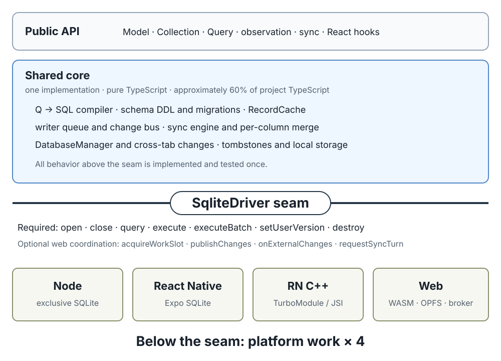

---
#Source of the maintainer guide.
#PDF, from docs/:
#pandoc codebase-guide.md -o remelondb-guide.pdf --pdf-engine=typst
#--toc --toc-depth=2 -N --include-in-header=codebase-guide.preamble.typ
#EPUB, from the repository root: pnpm guide:epub
title: "remelonDB: A Guide to the Codebase"
subtitle: "How the layers fit together, and why each one exists"
lang: "en-US"
date: "2026-08-20"
version: "0.1.9 · 2026-08-20"
---


# Preface {.unnumbered}

You can read this guide without keeping the repository open beside it. When the code depends on an idea such as a database transaction, advisory lock, SharedWorker, or CRDT-style merge, a **Background** aside explains it first. Skip those asides when the concept is already familiar.

This edition describes the codebase at version **0.1.9** or newer. Its content otherwise tracks `main`, and the stamped date records the last review. CI checks API summaries, repository paths, and structural assertions. Review covers claims that cannot be checked mechanically. Roadmap work in open issues is out of scope.

## What you are holding

remelonDB is an offline-first data layer. Application reads and writes use a database on the device; a background process later reconciles that database with a server and the user's other devices. It is a from-scratch rewrite of WatermelonDB: the ideas are inherited, the code is not.

The whole thing is about 9,500 non-test lines of TypeScript across eight packages. More than half lives in `core`, which is identical on every platform. The first three chapters explain how the design keeps most behavior there.

## How this guide is organized

The chapters go **outside-in**, so you can stop at any depth and still have learned a whole layer:

- **Part I (Chapters 1–3)** is the library as an application sees it: the problem it solves, the five calls that make up its entire public surface, and how one schema declaration becomes a table, a type, a class, and a set of network validators.
- **Part II (Chapters 4–6)** is the core: what a record is, what the database object guarantees, and how a query written as data becomes SQL.
- **Part III (Chapters 7–9)** goes below the driver seam: the small SQL-only contract every platform implements, the four drivers that implement it, and the machinery that lets several browser tabs share one database.
- **Part IV (Chapters 10–11)** is sync, on both sides of the wire: the client engine that decides how to merge, and the server engine that arbitrates between devices.
- **Part V (Chapters 12–14)** is change over time and proof: migrations, the React bindings, and how the project convinces itself any of this is correct — conformance suites and two formal models.
- **Part VI (Chapter 15)** puts the layers together in a real product: NotAnotherCards, from a local review action through authenticated replication and retention.

Six appendices follow: a glossary, the public API surface, a "where do I change X" reading map, checkpoint answers, the security model, and the sync wire protocol.

## Choose a route

Reading cover to cover gives the fullest picture, but the guide also supports shorter paths:

- **Build an application:** Chapters 1–3, 10, 13, and 15.
- **Add or maintain a driver:** Chapters 5–9 and 14.
- **Work on synchronization:** Chapters 10–11 and 14, then Appendices E–F.
- **Maintain the whole library:** follow the numbered chapters in order; each chapter assumes only the concepts introduced before it.

Every chapter ends with a **Checkpoint** containing a trace exercise and recall questions. Use it to reconstruct the path without looking back. Answers are in Appendix D.

> **A standing rule.** Where this prose and the tests disagree, the tests are right. The conformance suites in `packages/core/src/conformance/` and `packages/server/src/conformance/` are the closest thing the project has to a specification, and Chapter 14 reads them as such. File references name the containing function or test instead of fragile line ranges wherever possible.


# Orientation: the JavaScript and TypeScript you need {.unnumbered}

The code in this book is TypeScript. This chapter names the handful of syntactic things you will see on almost every page, so that later chapters can quote code without stopping to explain the language. If you read TypeScript fluently, skip to Chapter 1 — nothing here is remelonDB-specific.

## Modules: what a file needs and what it offers

A file states what it takes from other files and what it lets other files take from it.

```ts
import { z } from 'zod'
import { Database } from './Database'
```

`import { z } from 'zod'` pulls the single name `z` out of the installed package `zod`. The braces mean "pick these specific names." A path beginning with `.` (like `./Database`) names a file *next to this one*; anything else is a package installed from npm. On the other side:

```ts
export const Todo = z.object({ /* ... */ })
```

`const` binds a name that never gets reassigned; `export` makes it importable elsewhere. Without `export`, a name is private to its file. This matters more than it looks: several correctness properties in remelonDB rest on a value being *un-exported*, so that no code outside one file can construct it. You will meet that trick in Chapter 6, where a `Symbol` that is never exported is what stops a hand-forged query object from being mistaken for a real one.

## Values, objects, and functions

Curly braces with `key: value` pairs build an object, JavaScript's general-purpose structured value:

```ts
{ text: 'buy milk', done: false }
```

Functions have two spellings; this codebase overwhelmingly uses the second, the **arrow function**:

```ts
function add(a, b) { return a + b }
const add = (a, b) => a + b
```

When an arrow function's body is a single expression, the braces and `return` disappear; the expression becomes the return value. A function with no arguments is written `() => something`. Most importantly, **`() => something` is a function that has not run yet.** It hands work to code that decides when, or whether, to run it. Thus `db.write(() => collection.create(...))` gives `db.write` the work rather than its result.

## Types, and the fact that they vanish

TypeScript adds annotations that a compiler checks and then erases. Nothing about a type exists when the program runs.

```ts
const count: number = 5
const greet = (name: string): string => `hello ${name}`
```

Read `name: string` as "the argument `name` must be a string," and the `: string` after the parentheses as "this function produces a string." If the code does otherwise, the compiler refuses to build it — but at runtime the annotations are gone. This erasure is a theme. remelonDB repeatedly arranges for a *type* to catch a mistake at compile time and a *runtime check* to catch the same class of mistake at run time, because it cannot assume the type survived. Chapter 3's schema system is the clearest example: one `table(...)` call produces both a runtime object *and*, through a "phantom" type parameter that is `undefined` at runtime, the compile-time record type — two guards from one declaration.

> **Background: structural typing.** TypeScript types are *structural*, not *nominal*: two types are compatible if their shapes match, regardless of name. This is convenient, but it means a type alone cannot guarantee a value came from a trusted source — any object of the right shape satisfies it. That is precisely why the codebase pairs types with runtime brands (unique symbols) and validators in the places where provenance matters.

## Generics: a type you fill in later

A generic is a placeholder for a type that the caller supplies:

```ts
function first<R>(items: R[]): R { return items[0] }
```

`<R>` is a parameter; call `first([1, 2, 3])` and `R` becomes `number`, so the result is typed `number`. remelonDB uses generics to keep one piece of machinery correctly typed across many record types: the same `useQuery` hook serves a query of todos and a query of anything else, and returns the right element type for each, because the record type rides along as a generic parameter.

## Discriminated unions: a value that is one of several shapes

A union type `A | B` is "either an `A` or a `B`." When each variant carries a literal tag, TypeScript can *narrow* the union by checking the tag:

```ts
type Result = { ok: true; value: number } | { ok: false; error: string }
if (r.ok) r.value   // TypeScript knows this branch has `value`
else      r.error   // and this one has `error`
```

This pattern is everywhere in remelonDB's data: a query clause is `{ type: 'where', ... } | { type: 'and', ... } | ...`, a migration step is `{ type: 'create_table', ... } | { type: 'add_columns', ... }`, and the compiler that turns either into SQL is a `switch` over the tag. When you see a `switch (node.type)`, you are watching a discriminated union being taken apart.

## Promises and `async`/`await`

Some work does not finish immediately: reading from storage, talking to a server. A function that does such work returns a **Promise** — an object standing for an answer that is not here yet.

```ts
const todos = await db.get(TodoModel).query().fetch()
```

`await` means "pause here until that Promise has its answer, then continue with the answer itself." A function that uses `await` must be declared `async`, and calling an `async` function hands you back a Promise. The important consequence: the code reads sequentially but does not *block* — while one `await` waits, the rest of the program runs.

> **Background: why Promises matter to a database library.** A library that touches storage has to choose whether its interface is synchronous (the call returns the answer directly) or asynchronous (the call returns a Promise). The choice is not cosmetic. If any single platform must do its work on another thread — as the browser must, because the storage API remelonDB uses there is only available inside a Worker — then a synchronous interface makes that platform a second-class citizen or impossible. remelonDB makes *every* database call asynchronous, on every platform, even where the work underneath is synchronous, precisely so that shared code can never accidentally depend on an answer arriving in the same tick. Chapter 7 returns to this as a design decision; for now, just expect `await` in front of everything that crosses into the database.

With that vocabulary in hand, we can read the library from the outside.

# What remelonDB is, and what it solves

## The problem: an application that works with no network

Most data layers assume the network is present. The application asks a server for data, waits, and shows a spinner while it waits. When the network is slow the application is slow; when the network is gone the application is broken. Every interaction is a round trip, and the user feels every millisecond of it.

Offline-first inverts that arrangement. The application talks only to a database *on the device*. Reads and writes are local, so they complete in microseconds and they keep working with no network. Separately, in the background, a sync process reconciles the local database with a server and with whatever other devices the same user has. The user interface never waits for the network, because it never asks the network for anything — it asks the local database, always.

That inversion gives the application responsive local reads and offline writes. It also lets two devices change the same data without seeing each other. When they reconnect, remelonDB must merge those changes without dropping either device's work. Much of the codebase supports that reconciliation.

> **Background: the two-devices problem.** Imagine a todo whose text is "buy milk." On her phone, offline, the user corrects it to "buy oat milk." On her laptop, also offline, she ticks it done. When they sync, a system that copies whole records will let one write clobber the other: either the correction or the tick is lost. Systems that merge concurrent edits without a central coordinator are generally called *conflict-free replicated data types* (CRDTs), but full CRDTs can be heavy. remelonDB takes a narrower approach. It tracks *which columns* changed locally, preserving concurrent edits to different fields; a same-field clash falls back to last-writer-wins. Chapter 10 returns to the "buy oat milk" example.

## What the library actually is

remelonDB is a from-scratch rewrite of WatermelonDB, a well-known offline-first data layer for React Native. "From scratch" is precise: the ideas were inherited, the code was not. Three ideas came across, and they are worth naming now because the rest of the design follows from them.

**A query is data, not code.** When you write `Q.where('likes', Q.gt(10))` you do not run anything. You build a plain object that *describes* a question. A separate, pure function turns that description into SQL. Because the query is data, it can be inspected, compared, frozen, serialized to JSON, shipped across a thread boundary, and compiled by exactly one code path. That last property is what makes the second idea affordable.

**One engine, everywhere.** Every platform runs SQLite. React Native runs it through `expo-sqlite` by default, with a hand-written C++ TurboModule available as a separate package; the browser runs SQLite compiled to WebAssembly, stored in the Origin Private File System; Node runs `better-sqlite3`. Query semantics are inherited from SQLite rather than reimplemented per platform. There is no second engine anywhere — including in the observation path, which *re-queries SQLite* when data changes rather than matching rows in JavaScript. (Upstream keeps a second, in-memory JavaScript matcher for "simple" queries; remelonDB deleted it outright. Chapter 6 explains why that deletion is a correctness win, not a performance regression.)

**Reactive observation.** A query can be watched. When a write changes its answer, the watcher is handed the new answer — the whole answer, not a description of what changed. The user interface becomes a function of query results, and it updates because the results do.

### The shape of the codebase

The library ships as eight packages under the `@remelondb` scope. The bulk of the logic lives in exactly one of them. These are the non-test TypeScript line counts:

| Package | Source lines | What lives there |
|:--------------|----------:|:------------------------------------------------|
| `core` | 5,475 | Everything platform-independent |
| `driver-web` | 1,511 | SQLite-WASM + OPFS in a Worker; multi-tab broker |
| `server` | 1,434 | The sync backend engine |
| `store-drizzle` | 589 | A Postgres store adapter |
| `nestjs` | 203 | Sync endpoints for NestJS |
| `driver-rn-cpp` | 105 | The C++ TurboModule wrapper (plus vendored SQLite) |
| `driver-node` | 104 | `better-sqlite3` (tests, tooling, servers) |
| `driver-rn` | 104 | React Native over `expo-sqlite` (default) |

Around **9,500 non-test lines** of TypeScript in total, with **more than half in `core`**, written once and identical on every platform. The web driver carries most of the platform-specific code because it also owns the Worker, OPFS, RPC, and multi-tab machinery; each exclusive-storage driver remains about a hundred lines. The distribution matters more than the exact count: most behavior is written once above the seam.

## Why a rewrite rather than a patch

Two upstream WatermelonDB problems shaped this codebase.

The first was **platform breakage**. Upstream's native layer predates React Native's New Architecture. Its Android JSI build hand-compiles `jsi.cpp` from hardcoded ReactCommon paths that React Native no longer ships; its iOS and Android modules are classic-bridge with a manual JSI install that reaches into `RCTCxxBridge` internals that do not exist in bridgeless mode; its prebuilt `.so` files predate Google Play's 16 KB page-alignment requirement. These are separate failures with a single cause: the native layer was written against implementation details that moved.

The second problem is more interesting because it is a *design* problem, not a maintenance one. Upstream's web story is a separate engine, LokiJS, with its own query implementation. Two engines means two sets of query semantics, and keeping them in agreement is manual work that never ends: every operator has to behave identically on SQLite and on Loki, and nothing enforces it except vigilance. The codebase names this what it is — a permanent correctness tax.

Committing to one engine removes that tax, and it unlocks a structural change. If SQLite is the only engine, the boundary between shared code and platform code can move much further down.

## Moving the seam down

Upstream's portability boundary is an interface called `DatabaseAdapter`, with seventeen methods. Those methods speak in the vocabulary of the data layer: serialized queries, record caching, tombstones (`getDeletedRecords`), key-value local storage (`getLocal`), sync JSON. Every adapter had to reimplement all of those concepts — which is exactly how the project ended up with two engines drifting apart.

remelonDB's boundary is an interface called `SqliteDriver`, and it speaks only SQL. The full file, `packages/core/src/driver/SqliteDriver.ts`, is under a hundred lines and repays reading whole. Here is its required core:

```ts
interface SqliteDriver {
  open(name: string): Promise<{ userVersion: number }>
  close(): Promise<void>
  query(sql: string, args: SqlArgs): Promise<Row[]>
  execute(sql: string, args: SqlArgs): Promise<void>
  executeBatch(statements: Array<[sql: string, argSets: SqlArgs[]]>): Promise<void>
  setUserVersion(version: number): Promise<void>
  destroy(): Promise<void>
}
```

A driver knows how to run SQL and how to report a version number. It does not know what a record is, what a query is, what sync is, or what a tombstone is. Those became ordinary SQL issued by shared code. Deleting a record is an `UPDATE` that sets `_status = 'deleted'`; sync finds tombstones with a compiled query like any other. That change alone removed five methods from the boundary, and it made the web driver capable of sync without doing anything sync-specific.

This is why `core` is about five thousand lines and each exclusive-storage driver is about a hundred. The work was *moved*, not eliminated. Every concept that used to be reimplemented per platform is now written once, above the seam. The whole stack, drawn:

```{=typst}
#block(width: 100%, breakable: false, inset: 9pt, radius: 3pt, fill: luma(250), stroke: 0.5pt + luma(228))[
  #set text(size: 0.86em)
  #table(
    columns: (9em, 1fr),
    stroke: none,
    inset: (x: 5pt, y: 3.5pt),
    align: left + top,
    [*Public API*],
    [Model · Collection · Query (Q DSL) · observation · sync · `@remelondb/core/react` hooks],
    table.hline(stroke: 0.4pt + luma(160)),
    [*Core* \ #text(size: 0.86em, fill: luma(110))[one impl, pure TS \ ≈5,500 lines \ more than half of all TS]],
    [Q → SQL compiler (one pure fn; values only as bound `?` params) \
     schema DDL + migration-step compiler \
     RecordCache (identity map; sole owner of caching) \
     WorkQueue (one writer at a time) + change bus \
     sync engine (commit-ordered cursor; per-column merge) \
     DatabaseManager + applyExternalChanges (multi-tab) \
     tombstones + local storage = ordinary SQL],
    table.cell(colspan: 2, inset: (top: 6pt, bottom: 6pt))[
      #grid(columns: (1fr, auto, 1fr), align: horizon, column-gutter: 8pt,
        line(length: 100%, stroke: 0.9pt), [*SqliteDriver seam*], line(length: 100%, stroke: 0.9pt))
    ],
    [*required (7)*],
    [`open` · `close` · `query` · `execute` · `executeBatch` · `setUserVersion` · `destroy`],
    [*optional (4)*],
    [#text(size: 0.94em)[`acquireWorkSlot` · `publishChanges` · `onExternalChanges` · `requestSyncTurn`]#text(fill: luma(120))[  (web only)]],
    table.hline(stroke: 0.4pt + luma(160)),
    table.cell(colspan: 2, inset: (top: 5pt))[
      #grid(columns: (1fr, 1fr, 1fr, 1.15fr), column-gutter: 6pt, align: left + top,
        [*node* \ ≈104 ln],
        [*rn (expo)* \ ≈104 ln],
        [*rn-cpp (C++/JSI)* \ ≈105 ln],
        [*web (WASM + OPFS)* \ ≈1,500 ln + broker])
    ],
    table.hline(stroke: 0.4pt + luma(160)),
    table.cell(colspan: 2)[#align(center)[#text(fill: luma(115))[above the seam: written once  ·  below: × 4 platforms]]],
  )
]
```

```{=html}
<figure class="architecture-diagram">
  
  <figcaption>The shared core above the driver seam is written once; the four platform drivers below it carry the platform-specific cost.</figcaption>
</figure>
```

Read the double rule as the expensive line: everything above it is written once and tested once; everything below it is multiplied by four. The whole architecture is one long effort to keep that lower band thin.

> **Background: what a "seam" buys you.** A portability seam divides shared code from platform implementations. Code above it is written and tested once. Code below it must be implemented on every platform and kept consistent. Moving behavior above the seam reduces that repeated work; remelonDB's concentration of code in `core` follows from this choice.

### The seam's optional members

The seven methods above are the seam's required core. It also declares four *optional* methods, all in service of the browser's multi-tab capability (see `SqliteDriver` in `packages/core/src/driver/SqliteDriver.ts`):

```ts
  // cross-context write arbitration
  acquireWorkSlot?(exclusive: boolean): Promise<() => void>
  // broadcast a commit to the other tabs
  publishChanges?(changes: ExternalChangeSet): void
  // receive the other tabs' commits
  onExternalChanges?(handler: (c: ExternalChangeSet) => void): void
  // lease: may I be the one that syncs?
  requestSyncTurn?(): Promise<boolean>
```

The word that keeps this honest is **optional**. Core reaches for each of these only through optional-chaining (`driver.publishChanges?.(...)`), so a driver that owns its storage exclusively — Node, and both React Native drivers — implements the seven required methods and skips the four optional ones. Only `driver-web` implements them, and only in its shared mode. This is how the contract admits a capability that just one platform needs without imposing a cent of cost on the other three; Chapter 9 is the whole story of what those four methods coordinate.

## Two properties of the seam to carry forward

Two facts about the seam recur in later chapters, so state them once, now.

**The seam is asynchronous, always.** Every driver method returns a Promise, including on platforms where the work underneath is synchronous. This is not defensive style. The web driver must live in a Worker, because OPFS synchronous-access handles are only available there, so anything crossing to the web driver crosses a thread boundary. If the interface were synchronous, the web would be a second-class platform or an impossible one. Making it asynchronous *everywhere* means shared code cannot accidentally depend on same-tick resolution — a dependency that would work on native and break on web, i.e. the worst kind of bug, the kind that passes every test on the developer's machine.

**Values cross as placeholders, never as text.** The compiler emits `?` placeholders and passes the values alongside them. Nothing user-controlled is ever spliced into SQL text. Identifiers — table and column names, which *cannot* be parameterized in SQL — are validated against the regular expression `^[a-zA-Z_][a-zA-Z0-9_]*$` at the moment they are declared, and that single check is what licenses the compiler to interpolate a name directly into SQL text everywhere else. Upstream inlines query *values* by string-escaping them; its own source flags that as wrong. Chapter 6 shows the one, and only, function through which a value can reach the argument list.

## How to read the rest of this guide

The chapters go outside-in. Chapters 2 through 6 introduce the five recurring moves in a consumer and then descend through schema, records, the database, and query compilation. Chapters 7 through 9 cross the driver seam and solve multi-tab coordination. Chapters 10 and 11 cover sync on both sides of the wire. Chapters 12 through 14 cover migrations, React, and proof. Chapter 15 recomposes those pieces in a production application.

Every claim names a file you can open. Where prose and tests disagree, the tests win, and the conformance suites are the nearest thing to a specification the project has. The design documents in `docs/` record why decisions were made; read them after the corresponding chapter.

## Checkpoint

*Trace it yourself.* Open `packages/core/src/driver/SqliteDriver.ts` and separate the seven required methods from the four optional ones. For each optional method, predict which of the four drivers implements it, then check your prediction against `packages/driver-node/src/` and `packages/driver-web/src/`.

*Recall.* (1) What single hard problem does offline-first create, and what is the lighter-than-full-CRDT strategy remelonDB uses to attack it? (2) Why does making the *whole* seam asynchronous prevent a specific class of platform-specific bug? (3) Values cross the seam as `?` placeholders — but identifiers cannot be parameterized in SQL, so what makes it safe to splice a table name straight into SQL text? (4) Why is keeping most behavior above the driver seam more important than the exact percentage of code in `core`?

# The five moves: remelonDB from the outside

This chapter walks through a working application rather than invented snippets. `examples/todo-sync` is a synced todo list: you type a todo, it appears, and it appears on every other device running the same app. It is split into three parts that share one file:

```
examples/todo-sync/
  backend/     the shared schema, a small sync server, the client helper
  frontend/    a React web app
  mobile/      a React Native app
```

The interesting thing about the split is that `backend/schema.ts` is imported by all three. One file describes what a todo *is*, and the server, the browser, and the phone each derive their view of a todo from it. Every consumer of remelonDB makes the same five moves, and this application makes all of them in about sixty lines — so it is the entire public API in miniature. This chapter walks the first four; sync gets Chapters 10 and 11.

## Move 1: declare the schema once

`backend/schema.ts` is the whole data model, in about ten lines of substance:

```ts
export const Todo = z.object({
  text: z.string().min(1),
  done: z.boolean(),
  created_at: z.number().int(),
})

export const todos = zodTable('todos', Todo, { indexed: ['created_at'] })
export const schema = appSchema({ version: 1, tables: [todos] })
export class TodoModel extends ModelFor(todos) {}
export const wire = syncSchemas({ todos: Todo })
```

Line by line, because every later chapter refers back to one of these lines:

`z` is Zod, a library for *describing the shape of data*. `z.object({...})` builds a description — a todo has a `text` that is a non-empty string, a `done` that is a boolean, a `created_at` that is a whole number. Crucially, this description is a **value that exists at runtime**, which distinguishes it from a TypeScript type (which is erased). A runtime description can be used to *check data arriving from outside the program*, which is what the last line will exploit.

`zodTable('todos', Todo, ...)` converts that description into a table definition: a table named `todos` whose columns are the object's keys. The option `{ indexed: ['created_at'] }` asks SQLite to keep an index on `created_at`, which makes sorting and filtering by it fast.

> **Background: what an index is, and what it costs.** A database index is a secondary, sorted structure the engine maintains alongside a table so that it can find or order rows by a column without scanning every row. Looking up "todos where `created_at > X`, newest first" is a walk down a sorted tree instead of a full scan. Indexes are not free: every write must update every index on that table, so an index trades slightly slower writes and some disk for much faster reads on that column. remelonDB indexes what you ask it to, and — you will see in Chapter 3 — always indexes the internal `_status` column, because *every* query filters on it.

`appSchema({ version: 1, tables: [todos] })` collects every table into one schema and stamps it with a version number. That version is how the library knows whether the database on disk matches the code, and it drives migrations (Chapter 12).

`class TodoModel extends ModelFor(todos) {}` produces the class your application works with. The empty body is not an abbreviation. `ModelFor(todos)` reads the table definition and *generates the accessors*, so `todo.text` and `todo.done` exist, are correctly typed, and were never declared by hand. Most data layers make you write the fields twice — once for the database, once for the class. This one derives the second from the first, so they cannot drift.

`syncSchemas({ todos: Todo })` builds validators for the sync protocol out of the same Zod object. The browser uses them to check what the server sent; the server uses them to check what a client pushed. Neither side trusts the network, and both get their definition of "valid" from one source.

The result is **one declaration from which come the SQL table, the TypeScript record type, the model class, and the wire validators.** Change a field here and every layer either follows automatically or fails to compile. Nothing else in the application declares what a todo is. Chapter 3 is devoted to how one call produces four things.

## Move 2: open the database

`frontend/src/db.ts`, essentially in full:

```ts
let opened: Promise<Database> | undefined

export const openDb = (): Promise<Database> =>
  (opened ??= Database.open({
    driver: new WebSqliteDriver(),
    schema,
    modelClasses: [TodoModel],
    name: 'todo-sync.db',
  }))
```

`Database.open` takes four things: which driver to use, the schema, the model classes it should know about, and a name (a filename). It returns a Promise, because opening involves reading from storage and possibly creating tables.

`driver` is the *only platform-specific line in the entire application.* The web app passes `new WebSqliteDriver()`; the React Native app passes the driver for phones. Everything else — every query, every write, every sync call — is identical. That is the Chapter 1 seam, seen from above.

Two smaller pieces of syntax. `let` declares a name that can be reassigned, unlike `const`. `??=` assigns *only if the left side is currently `null` or `undefined`*, so the first call to `openDb()` starts the open and every later call receives the same Promise. That memoization matters: the web driver's storage permits one connection, so opening twice would fail. (This single-connection constraint is also the seed of the multi-tab problem in Chapter 9 — several tabs are several attempts to open the same storage.)

> **Background: opening as a decision, not a procedure.** Notice `Database.open` returns a `Promise<Database>` and hides everything behind it. Under the hood it does not run a fixed setup script; it reads the version already on disk and *branches*: fresh database, migrate an old one, use one that already matches, or refuse one that is newer than the code understands. Chapter 5 dissects those four branches. The externally visible contract is small — hand it a driver, a schema, and a name; get back a ready database or an error that tells you exactly what was wrong — but that small contract is doing consequential work.

## Move 3: write inside the gate

Every change to data in this application has the same shape. From `App.tsx`:

```ts
await db.write(() => db.get(TodoModel).create({ text: trimmed, done: false }))
await db.write(() => db.get(TodoModel).update(todo.id, { done: !todo.done }))
await db.write(() => db.get(TodoModel).markAsDeleted(todo.id))
```

Read the shape first. `db.write(...)` takes a *function* — the `() => ...` recipe from the orientation chapter. It does not take the *result* of the work; it takes the work itself and decides when to run it. The callback runs inside the serialized writer gate, so it cannot overlap another local read or write. `db.get(TodoModel)` returns the *collection* of todos, the object through which rows of that table are created, updated, and deleted.

Two rules carry the whole move.

**All mutations happen inside `db.write`. There is no other path.** Reads need no writer gate — fetching or observing works anywhere — but every change goes through the writer. Atomicity belongs to `db.batch`: each collection mutation prepares and commits a batch, and an explicit batch groups several prepared operations into one all-or-nothing unit — creates and updates via `prepareCreate`/`prepareUpdate`, and since v0.1.9 deletes too (`prepareMarkAsDeleted`/`prepareDestroyPermanently`), so a parent-and-children cascade commits as one transaction. Chapter 5 shows the commit point after an atomic driver batch resolves, where caches are updated and then, only then, subscribers are told.

**Deletion is not removal.** `markAsDeleted` flags the row rather than erasing it. The flagged row is a *tombstone*, and it exists so that sync can tell other devices this todo is gone. If the row simply vanished, there would be nothing left to tell them about, and the todo would resurrect the next time another device pushed its copy. Queries hide tombstones by default, so the row is invisible to the application while remaining visible to sync. There is a blunter method, `destroyPermanently`, which really does erase the row; sync never hears about it. It is the right call for data that never left the device, and the wrong call for anything else.

> **Background: what a transaction guarantees.** A database *transaction* is a group of operations that is *atomic* — all of them happen or none do — so a crash or error in the middle cannot leave half a change on disk. In remelonDB the atomic unit is the operation array passed to `db.batch`, which the driver executes as one transaction. The surrounding `db.write` callback is a serialization boundary, not an implicit transaction spanning every mutation it calls. Caches and notifications update only after each batch commits, so observers never see a half-applied batch.

## Move 4: read reactively

Reads reach React through the `useQuery` hook, from `@remelondb/core/react`:

```ts
const todos = useQuery(db.get(TodoModel).query(Q.sortBy('created_at', Q.desc)))
```

That is the whole of it — note there is no `useMemo`. Work outward from the middle. `db.get(TodoModel).query(...)` builds a query; it does not run it. The result is an object describing a question: all todos, newest first. `Q.sortBy` is one of the query builders, covered properly in Chapter 6. A query can then be asked in two ways:

- `.fetch()` runs it once and returns a Promise of the rows.
- `.observe(callback)` runs it now and again every time a write changes the answer. The callback receives the *full current answer* each time, not a description of what changed — so the consuming code never merges or patches; it is handed the new list and replaces the old one.

`useQuery` wraps `.observe` for React. It keys the subscription on the query's serialized table and clauses, not on the query object's identity. Rebuilding an equivalent query during render therefore reuses the same key and needs no `useMemo` or dependency array. Structurally equal queries on the same database also share one reference-counted observation, started by the first subscriber and stopped by the last. Chapter 13 shows the mechanism.

> **Background: reactivity without a diff.** Many reactive systems hand subscribers a *delta* — "row 3 changed, row 5 was added" — and make the subscriber apply it. That is efficient and error-prone: every subscriber reimplements the patching. remelonDB chooses the opposite: it re-runs the query against SQLite and hands you the complete, fresh answer. The cost is a re-query on every relevant change; the benefit is that the consumer is trivial and cannot drift out of sync with the source of truth. Because there is no in-memory matcher (Chapter 6), the answer you get is *exactly* what SQLite would return for that query — there is no second evaluator that might disagree.

Chapter 13 shows why keying on the query's structure, rather than its object identity, is what keeps this free of the usual reactive-hook footguns.

## Move 5: sync, in one paragraph

The fifth move is `synchronize({ database, pullChanges, pushChanges })`, called from `backend/client.ts`. You give it the database and two functions describing how to talk to your server; it decides what to send, what to do with what comes back, and what to do when the server says the request was based on stale information. In this application it runs on a short timer. Chapters 10 and 11 take it apart from both sides.

## The whole application, in order

```
schema.ts   one Zod object → zodTable + appSchema + ModelFor + syncSchemas
db.ts       Database.open({ driver, schema, modelClasses, name })
App.tsx     db.write(() => collection.create / update / markAsDeleted)
            useQuery(db.get(TodoModel).query(...))
client.ts   synchronize({ database, pullChanges, pushChanges })
```

Five moves, four of them a single line. What the remaining chapters do is go *under* each one: what a schema declaration actually builds (Chapter 3), what a record is (Chapter 4), what `db.write` guarantees and how observation knows when to re-run (Chapter 5), what a query compiles into (Chapter 6), what lives below the driver seam (Chapters 7–9), and what `synchronize` does on each side (Chapters 10–11).

## Checkpoint

*Trace it yourself.* Follow `todo.text` from the schema to the screen: find where the column is declared (`schema.ts`), where the accessor `todo.text` is generated (`ModelFor`, Chapter 4), and where the value is read in `App.tsx`. How many times is the field name `text` written by hand across the whole application?

*Recall.* (1) Why does `markAsDeleted` leave the row in place instead of deleting it — what breaks if the row simply vanishes? (2) What does `db.write()` serialize, and when must operations be grouped into one `db.batch` to be atomic? (3) The new `useQuery` needs no `useMemo` around its query; what is it keying the subscription on instead of object identity? (4) Which single line of the example is platform-specific, and what does that tell you about the seam?

# Schema: one declaration, several consequences

Chapter 2 claimed that a single declaration produces the SQL table, the record type, the model class, and the wire validators. This chapter shows how, because the mechanism explains several things that would otherwise look arbitrary: why only three column types exist, why some names are refused, why the generated SQL declares no types at all, and why the whole thing is built to be *impossible to declare inconsistently*.

The code is in `packages/core/src/schema/` (the builders, the DDL compiler, and migrations) and `packages/core/src/zod/` (the Zod adapter, exposed as `@remelondb/core/zod`).

## Two ways to declare a table, one result

The example uses Zod, but both declaration routes produce the same table object. Start with the underlying builders:

```ts
import { column as c, table } from '@remelondb/core'

const tasks = table('tasks', {
  name: c.string(),
  position: c.number().indexed(),
  project_id: c.string().optional(),
})
```

`column.string()`, `column.number()`, and `column.boolean()` are the entire column vocabulary. Each returns a small *frozen* object carrying its type and two flags, and each has two modifiers: `.optional()` means the column may hold SQL `NULL`, which appears in your records as `null`; `.indexed()` asks SQLite to maintain an index on it. The modifiers return *new* objects rather than mutating the one they were called on:

```ts
optional(): ColumnDef<T, true> { return columnDef(type, true, isIndexed) }
```

That immutable-builder style means you can hold on to `c.string()` and derive several columns from it without them interfering — a small thing that removes a whole category of aliasing bug.

The Zod route (`zodTable`) walks a `z.ZodObject`'s shape, maps each field to a column, and calls the *same* `table()` underneath. This is not a claim to take on faith: a test pins it (the equivalence test in `packages/core/src/zod/index.test.ts`). `zodTable('tasks', Task, { indexed: ['position'] })` is `.toEqual()` to the hand-written `table('tasks', {...})`, and the table object inside the resulting `appSchema` is the *same object reference*. `zodTable` is sugar over `table`, not a parallel implementation — so anything true of one is true of the other, and this chapter can speak of "the table definition" without qualification.

## Why exactly three column types

`ColumnType` is `'string' | 'number' | 'boolean'`, and the reason for the short list is at the top of the file: **columns are typeless in SQL.** SQLite has dynamic typing, so declaring a column `TEXT` does not stop you storing a number in it. Since the declared type cannot be enforced by the database, remelonDB uses it for the two things it *can* enforce: sanitizing values on the JavaScript side (Chapter 4), and choosing a default when a migration adds a column to existing rows (Chapter 12). A vocabulary of three keeps that logic small and keeps the set of value types crossing the driver seam small — which in turn keeps every driver simple. Anything richer than string/number/boolean must be encoded as one of the three: a timestamp is a `number`, an enum is a `string` your code interprets.

> **Background: dynamic typing in SQLite.** Most SQL databases enforce column types: put a string in an integer column and the insert fails. SQLite instead has *type affinity* — a column has a preferred type but will store whatever you give it. This is unusual and occasionally surprising, but remelonDB turns it into a simplification: since the engine will not police types anyway, there is no point declaring them, and the DDL you will see below declares none. Type discipline is enforced one layer up, in JavaScript, where remelonDB controls every value that goes in.

## What every table gets for free

Three columns are added to every table and cannot be declared by you:

- `id`, the primary key, a string.
- `_status`, the sync state of the row: `created`, `updated`, `synced`, or `deleted`.
- `_changed`, a comma-joined list of which columns have local changes not yet pushed.

Chapter 4 covers what those two underscore columns *do*. What matters here is that they are reserved, along with SQLite's internal row-identifier aliases:

```ts
const RESERVED_COLUMNS = new Set([
  'id', '_status', '_changed',
  'rowid', 'oid', '_rowid_',
])
```

Declaring any of them throws. The last three are refused because they are alternative names for SQLite's built-in row identifier, and a user column with one of those names would silently shadow it. Two conventional column names get an extra rule:

```ts
if ((column.name === 'created_at' || column.name === 'updated_at') &&
    (column.type !== 'number' || column.isOptional)) {
  throw new Error(`Column '${column.name}' must be a non-optional number`)
}
```

These names are not required, but *if* you use them they must be non-optional numbers, because parts of the system treat them as timestamps. This is a small instance of a pattern you will see repeatedly: rather than allow a half-supported thing and document the caveat, the library **refuses at construction time with a message naming the exact problem.** A half-supported feature is a bug with a manual; a loud refusal is a bug that never ships.

Table names have their own reservations. `local_storage` is taken by the library itself (it stores the sync cursor and an app-facing key/value area there), and anything beginning `sqlite_` is reserved by SQLite. Both table and column names pass through one identifier check:

```ts
const IDENTIFIER = /^[a-zA-Z_][a-zA-Z0-9_]*$/
```

The comment beside it names its job precisely: it is "the only line of defense that lets the SQL encoders interpolate identifiers into SQL text." Because a name that passes this regex cannot contain a quote, a space, or a semicolon, the compiler can splice it straight into DDL and DML with no further escaping. This is the identifier half of the "values as placeholders, identifiers by regex" rule from Chapter 1.

## `appSchema`: versioning the whole thing

```ts
export function appSchema(spec: { version: number; tables: readonly TableSchema[] }): AppSchema {
  if (!Number.isInteger(spec.version) || spec.version < 1) throw new Error(/* ... */)
  // ...bundle tables into a name-keyed map, reject duplicates...
  return deepFreeze({ version: spec.version, tables })
}
```

`appSchema` bundles a list of tables into a version-stamped, deep-frozen schema. Duplicate table names throw here; duplicate columns threw earlier. The version is the pivot the whole migration story turns on (Chapter 12): `Database.open` compares it against the number on disk and decides what to do. The doc comment states the maintenance rule in one line — *bump `version` and provide migrations whenever a table or column is added.*

## What it compiles to

The DDL compiler turns a schema (and, later, migration steps) into a list of single SQL statements. Table creation declares columns with **no SQL type at all**:

```ts
function encodeCreateTable(table: TableSchema): string {
  const columns = [
    '"id" primary key', '"_changed"', '"_status"',
    ...table.columnArray.map((column) => `"${column.name}"`),
  ].join(', ')
  return `create table "${table.name}" (${columns})`
}
```

So `table('tasks', {...})` becomes:

```sql
create table "tasks" ("id" primary key, "_changed", "_status", "name", "position", "project_id")
```

— confirming the point above: the declared `ColumnType` never appears in the DDL, because SQLite would not honour it anyway. Indexes are emitted next: every `.indexed()` column gets a `create index if not exists`, and `_status` is **always** indexed on every table, regardless of what you declared, because every query filters on it (the soft-delete check `_status is not 'deleted'`) and so does sync:

```ts
function encodeTableIndices(table: TableSchema): string[] {
  return [
    ...table.columnArray.filter((c) => c.isIndexed).map((c) => encodeIndex(table.name, c.name)),
    encodeIndex(table.name, '_status'),
  ]
}
```

The whole statement list is prefixed with the DDL for `local_storage` — `create table "local_storage" ("key" primary key not null, "value")` — which is where the reserved table name from earlier gets its concrete schema. Migrations reuse these same encoders; that is why Chapter 12 can describe a migration as "the same DDL compiler, pointed at a step instead of a whole schema."

## The type-level half

Everything so far has been runtime data. The same `table(...)` call also produces the compile-time record type. `TableSchema<Cols>` carries a **phantom field** `$cols?: Cols`, always `undefined` at runtime, so downstream types can recover the original column specification by inference. `InferRecord` uses it here:

```ts
export type InferRecord<T extends TableSchema<ColumnsSpec>> =
  T extends TableSchema<infer Cols>
    ? { readonly id: string } & {
        [K in keyof Cols & string]:
          | (Cols[K] extends ColumnDef<infer CT, boolean>
              ? CT extends 'string' ? string : CT extends 'number' ? number : boolean
              : never)
          | (Cols[K] extends ColumnDef<ColumnType, true> ? null : never)
      }
    : never
```

`id` is always present, readonly, and a string. Each declared column maps its `ColumnType` to the corresponding TypeScript type, while an `.optional()` column unions in `null`. The codebase uses `null`, not `undefined`, for absent database values, including through the Zod adapter below. A compile-time test probes the boundary with `@ts-expect-error`: reading a misspelled model field or the internal `_status` must fail to typecheck. As the file comment puts it, the schema literal is the source for record types, column-name checking in `Q`, and collection types.

> **Background: phantom types.** A *phantom type* is a type parameter that carries information at compile time but corresponds to no runtime value — here, `$cols?: Cols` is declared but never assigned, so it is `undefined` when the program runs. Its only job is to let the compiler remember the exact column spec so that `InferRecord`, `ColumnName`, and the model's field types can all be computed from it. This is how one runtime `table(...)` call also produces a precise static type without you writing the type out: the runtime object smuggles the type along in a field that does not exist at runtime.

## The Zod route in full

The Zod adapter has two halves, and its file header frames them: `zodTable` derives a *client* table definition, while `syncSchemas` builds *wire* validators for pull and push — deliberately in "pure Zod, so a server can use them without depending on remelonDB."

**Mapping.** `z.string()` → `column.string()`, `z.number()` → `.number()`, `z.boolean()` → `.boolean()`. `.nullable()` on any of them becomes `.optional()` (SQL `NULL`). Zod's own `.optional()` — which means `undefined` — is a *loud build-time error*:

```ts
if (inner instanceof z.ZodOptional) {
  throw new Error(`zodTable: column '${key}' uses .optional() — the value vocabulary has null, not undefined; use .nullable()`)
}
```

Anything the adapter does not understand — enums, dates, nested objects, defaults — throws too, naming the supported set. Refinements like `.min()`, `.max()`, `.email()` are transparent: they narrow values but do not change the base type, so `z.string().email()` is still a `string` column. This is the same philosophy as the schema builders — refuse the unsupported thing at build time rather than mis-handle it at run time.

**`syncSchemas`** takes a map of table name → `ZodObject` and builds the validators the sync protocol needs:

- `rows[name]` is a `z.strictObject({ ...schema.shape, id })` — a wire record is your columns plus `id` and *nothing else*. Because it is `strictObject`, an extra key is rejected, so the internal `_status`/`_changed` can never be smuggled onto the wire; if some bug tried, the parse would fail loudly.
- `changeSets[name]` is `{ created: row[], updated: row[], deleted: id[] }`.
- From these it assembles `pullArgs`, `pullResult` (`{ changes, cursor } | { resyncRequired: true }`), `pushArgs`, and `pushResult`, the last with a refinement enforcing that "cursor and changes are a package: both or neither."

**Where validation runs.** On the client, `validatePullResult` and `validatePushResult` inspect every server response before core applies it: the initial pull, a resync pull, and the push. The parsers built here fit directly, for example `validatePullResult: (r) => sync.pullResult.parse(r)`. A parse failure stops sync before the atomic local write.

On the server, `sync.pushArgs.parse(requestBody)` validates the request as a normal DTO without importing remelonDB. Local writes instead use Chapter 4's lenient `sanitizedRaw` path. Zod guards the two network crossings: server responses entering the client and client requests entering the server.

## A maintainer's note: append-only lives on the server, not here

The server engine supports *append-only tables* (Chapter 11) — tables where writing to an existing id is rejected. It is worth knowing while you are in the schema chapter that this flag lives **only** on the server engine's per-table config (`packages/server/src/engine.ts`), not in `table()`/`column` or `zodTable`. A team modelling an event log therefore declares the table normally and configures `appendOnly` separately on the server — on the engine's table config directly, or through the NestJS module's `tableOptions` passthrough — with nothing at the schema level tying the two together. It is one of the few facts about a table the schema literal does not carry.

## Checkpoint

*Trace it yourself.* Write a `zodTable` for a `notes` table with a nullable `body`. Predict the exact `create table` SQL it will compile to (remember the three free columns and the always-indexed `_status`), then find `encodeCreateTable` and check. Now predict what happens if you name a column `rowid`, or make `created_at` optional.

*Recall.* (1) Why does the generated DDL declare no column types? (2) `_status` is indexed on every table even if you never asked — why? (3) How does one table declaration provide both runtime schema information and a compile-time record type? (4) The Zod adapter rejects `z.string().optional()` but accepts `z.string().nullable()`. What rule is it enforcing, and where does that same rule show up in the inferred record type?

# Records and models: two representations of a row

A single row of a table exists in the running program in two forms, and keeping them straight is the key to Chapters 4 and 5. The **raw record** is the data — a plain object of column values. The **model** is the object your application holds — a class instance with typed accessors, identity, and methods. This chapter builds both from the bottom, because the boundary between "data arriving from outside" and "the trusted in-memory object" is where several of the library's guarantees are enforced.

The code is in `packages/core/src/rawRecord/` and `packages/core/src/model/Model.ts`, with the collection glue in `database/Collection.ts`.

## The raw record

A `RawRecord` is the low-level shape (`rawRecord/index.ts`): an `id`, the bookkeeping columns `_status` and `_changed`, and the schema columns. Each value is a `SqlValue`: `string | number | boolean | null`. Booleans are real booleans in a raw record even though drivers store them as `0`/`1`; conversion at the edge keeps that storage detail out of core.

## The trust boundary

Every record that enters the system passes through `sanitizedRaw(dirty, table)` (`rawRecord/index.ts`). This includes rows read from SQLite, sync payloads, and values supplied to `create`, so a `RawRecord` in memory is "valid by construction." The gate coerces the `id` (generating one with `randomId()` if absent), validates `_status` and `_changed`, and runs `sanitizeValue` for each declared column. Anything outside the table's column list is not copied. **Unknown keys are dropped** because the loop iterates over the schema, not the input.

```ts
const cached = this.map.get(id)   // (identity map, see Chapter 5)
if (cached) return cached
const raw = sanitizedRaw(row, table)
this.map.set(id, raw)
return raw
```

`sanitizeValue` (`rawRecord/index.ts`) type-checks each value against its column: numbers must be finite (no `NaN`, no `Infinity`); a boolean column accepts `0`/`1`; a string stays a string. On a mismatch it does not throw — it falls back to the column's *null value*: `null` if the column is optional, otherwise the empty-ish default for its type (`''`, `0`, `false`). This leniency is deliberate and worth contrasting with a stricter path: sanitization *coerces and drops* rather than rejecting, because it sits on the hot path where data flows in constantly and a single bad value from the network should degrade one field, not fail an entire sync. Where strictness is wanted — the network trust boundary — that is Zod's job, one layer out (Chapter 3).

> **Background: a trust boundary.** In security and in data plumbing, a *trust boundary* is a line data crosses when it moves from a context you do not control into one you do. The classic mistake is to have many such crossings, each with its own ad-hoc validation, some forgotten. remelonDB funnels *all* record ingress through one function, so there is exactly one place where "is this value acceptable for this column?" is decided. One gate is auditable; a dozen scattered checks are not. When you review this code, the question "what could a malformed value do here?" has a single answer to read.

## Dirty tracking: `_status` and `_changed`

These two columns are how the library remembers what it still owes the server. `_status` is the row's sync state; `_changed` is the set of columns edited locally since the last push. `markAsChanged(raw, col)` (`rawRecord/index.ts`) maintains them:

```ts
// created or deleted records are left alone: the whole record is new or gone
if (raw._status === 'synced') raw._status = 'updated'
raw._changed = addToSet(raw._changed, col)   // comma-joined column set
```

A record that is already `created` or `deleted` is not touched — the entire record is pending anyway, so per-column tracking would be noise. Only a `synced` record transitions to `updated` and starts accumulating changed columns. A subtle correctness point lives in the caller: `prepareUpdate` invokes `markAsChanged` *only for columns whose sanitized value actually changed* (`Collection.prepareUpdate`). Assigning a field its current value marks nothing dirty, which keeps `_changed` honest and — you will see in Chapter 10 — is what lets a device's genuine edits survive a concurrent sync while no-op writes do not needlessly win conflicts.

These two columns are the local state that Chapter 10's conflict rules interpret.

## The model layer

The model is the object your code holds, and it has a runtime half and a compile-time half — the same two-halves-from-one-declaration pattern as the schema.

**Runtime half: generated accessors.** When a model class is bound to its collection, `defineModelAccessors(cls, columns)` (`Model.defineModelAccessors`) walks the schema columns and defines a getter/setter pair per column *on the prototype*. So `todo.text` is not a field written by hand; it is a generated accessor that reads from the record. Two details make it safe:

```ts
get() { return (this._pendingFields ?? this._raw)[name] }
set(v) {
  if (!this._pendingFields) throw new Error(/* writes only inside an update builder */)
  this._pendingFields[name] = v
}
```

Reads come from `_pendingFields` while an `update()` or `prepareUpdate()` builder runs and otherwise from `_raw`. Writes are *only legal inside one of those builders* — assigning `todo.text = 'x'` anywhere else throws. And if a column name would collide with an existing property on the class prototype, binding throws at that moment, naming the collision, rather than silently shadowing a method. A `WeakSet` guards against binding the same class to two databases.

**Compile-time half.** `ModelFor(schema)` (`ModelFor`) returns a base class whose static `table` and `schema` are set and whose *instance field types* are inferred from the table:

```ts
type TypedModel<T> = Model & Omit<InferRecord<T>, 'id'>
```

Nothing is declared by hand, so nothing can drift. The same inference also feeds `Database.get` the set of legal `Q` column names, so a query that names a column the table does not have fails to compile. This is the schema's `InferRecord` from Chapter 3, cashed out as the type of a live object.

## Identity: one model instance per row

For each row id there is exactly one model instance, cached in the collection and created lazily by `_recordFor` (`Collection._recordFor`). Ask for the same todo twice and you get the same object both times. This is not just tidy; observation depends on it. When a write updates a record, the cached raw is mutated *in place* (an `Object.assign`, Chapter 5), so the model instance every component is holding reflects the new values without anyone re-fetching. When the row is destroyed, an internal subscription evicts the model instance from the collection.

> **Background: identity map, and value versus entity.** An *identity map* is a cache that guarantees at most one in-memory object per database row, keyed by primary key. It solves a problem you feel immediately without one: if two parts of the UI each load "todo 42" and get two different objects, an edit through one is invisible to the other, and you are back to manual synchronization. By making the model an *entity* — something with identity, not just a bag of values — remelonDB lets reactivity work: everyone points at the same object, so everyone sees the same update. Chapter 5 shows the single line (`Object.assign` into the cached instance) that upholds this on every commit.

## Lifecycle and associations

The lifecycle methods all delegate to the collection. Committing methods are writer-gated (they only work inside `db.write`): `create`, `update(builder)` (which collects `_pendingFields` and applies them), `markAsDeleted` (the tombstone), and `destroyPermanently` (the real delete). `prepareUpdate(builder)` collects the same fields but returns an operation for a later `db.batch`, leaving the cached model untouched until that batch commits. Associations come in two directions:

- `children(table)` returns a `has_many` query — a todo's sub-items, say.
- `related(table)` returns the `belongs_to` parent.

`related` handles a state that offline sync can produce (`Model.related`):

```ts
const record = /* look up the FK target */
return record ?? null
```

It returns `null` when the foreign key is null or when it names a row that is gone. Sync may delete a parent on another device while this device still holds the child's foreign key. Treating that parent as absent lets callers render the parent's name when available and nothing when it has vanished. Chapter 10 explains the sync race that creates this state.

## Checkpoint

*Trace it yourself.* Follow a single `create({ text: 'hi', bogus: 1 })` into `sanitizedRaw`. What happens to the `bogus` key? Now follow `update` of an unchanged field: does `_changed` grow? Find the line in `prepareUpdate` that decides.

*Recall.* (1) What are the two representations of a row, and which one does your application code hold? (2) Sanitization *drops and coerces* rather than throwing — why is that the right choice on the write path, and what stricter mechanism guards the network boundary instead? (3) Why must there be exactly one model instance per row id for reactivity to work? (4) Why must `related()` return `null` when sync has removed the referenced parent, even if the child still holds its foreign-key value?

# The database core: opening, writing, observing

This is the chapter the last three were building toward. The `Database` object (`packages/core/src/database/Database.ts`) serializes work, commits explicit batches atomically, keeps caches honest, and tells observers that the world changed. It is also where the multi-tab machinery of Chapter 9 quietly reaches in, so a few lines here will only fully make sense after that chapter — they are flagged where they appear.

## Opening: a decision, not a procedure

`Database.open(options)` in `database/Database.ts` takes a `driver`, a `schema`, an optional `migrations` list, optional `modelClasses`, and a required `name`. What it does *not* do is run a fixed setup script. It asks the driver for the persisted `user_version` and then **branches** on it:

```ts
const { userVersion } = await driver.open(name)
if (userVersion === 0)                    // fresh: encode the schema DDL, set the version
else if (userVersion < schema.version) {  // an older database: migrate it, or…
  const steps = migrations ? stepsForMigration(/* from → to */) : null
  if (steps === null) throw new Error(/* no migration path — refuse, do not wipe */)
} else if (userVersion > schema.version) throw  // newer than this build: refuse
// userVersion === schema.version falls through: ready
```

Four outcomes: fresh-setup, migrate, ready, or an explicit error. Two of them are refusals, and their existence is a design statement. A missing migration path is a **hard error, never a silent wipe**; a database newer than the application (an old build meeting new data) is refused rather than downgraded. Chapter 12 calls this the *no-silent-reset contract* and explains why upstream's destroy-and-recreate fallback was a data-loss trap worth removing.

After the branch, `open` wires the object up: it builds the association map (merging any model-less associations with each model class's own), constructs one `Collection` per schema table, and binds each model class to its collection by matching the class's static `table` string. Then, when the driver supports multi-tab, one more line:

```ts
driver.onExternalChanges?.((changes) => this.applyExternalChanges(changes).catch(() => {}))
```

If the driver can deliver commits from *other contexts* — other browser tabs — `open` subscribes, so those commits flow into this database's caches and observers. The `.catch(() => {})` is deliberate: a failed external apply must not tear down the driver's listener. Hold this line; it is the receiving end of Chapter 9.

## The work queue

Every `db.write` and `db.read` routes through one strictly FIFO `WorkQueue` (`WorkQueue.ts`). **Readers are not concurrent.** The `isWriter` label changes what mutations are allowed, not how work is scheduled. A `read` block is a consistency window in which no writer runs. Re-entrancy is unsupported and will deadlock, so call plain functions inside one block instead of nesting `db.write` or `db.read`.

> **Background: why serialize at all?** Concurrent writers to a database need coordination or they corrupt each other's assumptions — one transaction reads a value another is halfway through changing. The heavy-duty answer is locking and isolation levels. remelonDB takes the simplest correct answer available to a single-process library: a queue that runs one unit of work at a time. It gives up read parallelism (which, for a local SQLite database answering in microseconds, is rarely the bottleneck) in exchange for a model simple enough to reason about completely — and simple enough that the multi-tab extension in Chapter 9 could be bolted on as "acquire a *cross-tab* slot before entering this local queue" rather than a redesign.

That bolt-on is the one subtlety here. When the driver offers a cross-context `acquireWorkSlot`, `withWorkSlot` acquires the slot *before* the block enters the local queue. The ordering is not incidental: while this context waits for its cross-tab grant, the local queue stays free to apply broadcasts from other tabs, so a read that eventually runs never trusts a cache another tab has already moved past. Getting this backwards produces a lost update — and a convergence test in `driver-web` exists precisely because an earlier version *did* get it backwards. Chapter 9 pays this off.

## Compiling and committing a batch

`Database.batch(operations)` is the *sole* commit path — every create, update, and delete funnels here. It asserts a writer is running, no-ops on an empty batch, then compiles, executes, updates caches, notifies, and publishes, in that order. A collection convenience method may call it immediately; callers that need several prepared operations to share one transaction pass them together explicitly.

Compilation is `encodeBatch` (`encodeBatch.ts`): each operation becomes one `[sql, args]` pair, and **consecutive operations with identical SQL are grouped** into a single prepare-once-run-many statement. Creating fifty todos in one write is one prepared `insert` run fifty times, not fifty prepares. The SQL shapes are exactly what Chapter 2 promised: a delete of a todo via `markAsDeleted` is `set _status='deleted', _changed=''`; a real `destroyPermanently` is a `delete`.

The commit contract is where the guarantees live in `Database.batch`:

1. `driver.executeBatch` is **atomic** — the whole batch commits or none of it does.
2. Caches and notifications are touched **only after it resolves.** If it rejects, in-memory state is untouched and the error propagates. There is no window where the cache reflects a write that did not land.
3. The order after success is deliberate: **first** bring every cache fully up to date, **then** notify. So by the time any subscriber runs, every cache reflects the entire batch — no observer sees a half-applied world.

Per operation, the cache is mutated to preserve identity: a create adds the raw; an update does `Object.assign` *into the cached instance* (Chapter 4's identity guarantee, upheld right here); a delete flips `_status` and removes it. Finally:

```ts
driver.publishChanges?.(changeSet)   // tell other tabs — only real commits publish
```

Only genuine commits broadcast. The receiving path, `applyExternalChanges`, must *not* re-publish, or two tabs would echo a change back and forth forever. Chapter 14's formal model protects this commit-versus-external-apply asymmetry.

## The record cache

`RecordCache` (`RecordCache.ts`) is a `Map<string, RawRecord>` and the *sole* owner of caching: one raw instance per id, owned entirely by JavaScript. Each collection has its own. Its resolution point, `recordFromRow`, is where the identity map earns its keep: if an instance for `row.id` is cached, it is returned and its in-memory state is authoritative (drivers always return full rows, so there is no partial-row desync to reconcile); otherwise the row is sanitized, cached, and returned. Cached instances are updated in place on commit and removed explicitly on destroy. There is no TTL and no eviction — the cache tracks live rows, and a destroyed row's exit is an explicit `delete`, not a timeout.

## Observation: emitting only on real change

A watched query (`Query.observe`, `Query.observe`) subscribes to *all* tables it touches — its base table plus any joined tables — and re-fetches when any of them changes. Two mechanisms make that both correct and quiet.

**An out-of-order guard.** Each refetch carries a `generation` counter; if a newer refetch has begun by the time an older one's async result arrives, the stale result is discarded. Without this, two writes in quick succession could deliver their query answers out of order and leave the UI showing the older one.

**Real-change detection.** After a refetch, `differs` compares the result with a saved snapshot: first the length, then each row's identity and visible columns. Identity alone is insufficient because commits mutate cached raws in place; the same object may now contain different values. Each emission therefore snapshots visible columns as well.

A change limited to `_status` or `_changed`, such as sync marking a pushed record clean, changes no visible column and emits nothing. Background bookkeeping does not re-render the UI.

What a subscriber receives is a *full answer*: a fresh array of the canonical cached model instances, never a diff. `observeCount` is the simpler count variant; `Model.observe` emits the record now, on each update, and `null` when it is destroyed.

Two optional channels complete the picture. Both `observe` and `observeCount` accept a second callback for **errors**: with it, a failed refetch is delivered as a value (the React hooks in Chapter 13 turn it into renderable state); without it, the failure stays a loud unhandled rejection. The failure handler rides the two-argument form of `then`, so it sees only *fetch* rejections — a subscriber that throws is an app bug and is never mislabeled as a query error. And `Database.open` accepts **`onObservation`**, a passive diagnostics hook: every refetch reports its table, query description, records-or-count mode, initial-or-change trigger, duration, result count, and whether it succeeded, failed, or was discarded as stale. It is strictly an observer of the observer — exceptions it throws are swallowed, and no timing is even collected when it is absent.

## The path of a write, end to end

Put it together. A `todo.update` inside `db.write`:

1. enters `withWorkSlot(exclusive: true)` — acquiring a cross-tab slot first if the driver has one, then the local queue;
2. `Collection.prepareUpdate` sanitizes the new values, stamps `updated_at`, and dirty-tracks only the columns that actually changed;
3. `Database.batch` asserts a writer, `encodeBatch` compiles (grouping identical SQL);
4. `driver.executeBatch` commits atomically;
5. on success, the caches are updated in place — identity preserved;
6. `notifyChanges` fans out to database- and collection-level subscribers; each affected `Query.observe` refetches, and the `differs` gate emits a full fresh result only if a *visible* column changed;
7. `driver.publishChanges` broadcasts the change set to other tabs, whose `open`-registered listener calls `applyExternalChanges` to update their caches and observers — without re-writing and without re-publishing.

Steps 1 and 7 are the multi-tab seam; steps 2 through 6 are the whole of single-tab correctness. If you can reconstruct this list from memory, you understand the core.

```
 db.write(() => todo.update(...))
      │
      ▼
 withWorkSlot(exclusive = true)
   ├─ acquireWorkSlot?(true)      ← cross-tab slot (web shared mode only)
   └─ WorkQueue.enqueue           ← one writer at a time
      │
      ▼
 Collection.prepareUpdate         sanitize · stamp updated_at ·
      │                           dirty-track ONLY changed columns
      ▼
 encodeBatch                      group consecutive identical SQL
      │
      ▼
 driver.executeBatch ── atomic ──►  SQLite commit (all-or-nothing)
      │  (on success only, in this order:)
      ▼
 update caches in place           Object.assign → identity preserved
      │
      ▼
 notifyChanges ─► Query.observe refetch ─► differs gate ─► emit
      │                              (visible columns only; no _status noise)
      ▼
 driver.publishChanges?(changeSet)  ← broadcast to other tabs
                                       (real commits only, never re-published)
```

The two dashed remarks are the invariants: caches are brought fully current *before* anyone is notified, and only a real commit publishes.

## Checkpoint

*Trace it yourself.* In `Database.batch`, find the exact point where the cache is updated and the exact point where subscribers are notified, and confirm the order (cache first). Then find the line that makes an *update* preserve object identity. Why would notifying before updating the cache be a bug?

*Recall.* (1) A `db.read` block runs serially with writers and with other reads — so what does "read" actually promise? (2) Why does change-detection compare *visible column content* and not just object identity? (3) When sync marks a record `synced`, why does that not re-render the UI? (4) `publishChanges` fires only on real commits, never from `applyExternalChanges`. What goes wrong if that asymmetry is broken?

# Queries as data: the Q DSL and its compiler

Chapter 1 named "a query is data, not code" as the first inherited idea. This chapter cashes it out. A query in remelonDB is a plain, frozen, JSON-serializable object; a separate pure function turns it into parameterized SQL; and every value in that SQL is a bound placeholder while every identifier was vetted by a regex at construction time. The result is a query layer with no string-interpolated values anywhere and no second evaluator to keep in sync — two properties this chapter will show are the point.

The implementation spans four small files: `query/ast.ts` defines the tagged nodes, `query/Q.ts` constructs them, `query/encodeQuery.ts` compiles them, and `database/Query.ts` wraps fetching and observation.

## What a query actually is

Building a query executes nothing. `Q.buildQueryDescription(clauses)` folds an array of clauses into one object:

```ts
export interface QueryDescription {
  readonly where: readonly Where[]
  readonly joinTables: readonly string[]
  readonly nestedJoinTables: readonly NestedJoinTable[]
  readonly sortBy: readonly SortBy[]
  readonly take?: number
  readonly skip?: number
  readonly sql?: UnsafeSqlQuery
}
```

That is the entire vocabulary of a query: some conditions, some joined tables, some sorts, an optional limit/offset, and an optional raw-SQL escape hatch. Outside production, the result is deep-frozen, and it round-trips through `JSON.stringify`/`JSON.parse` unchanged — proof that it is inert data, which is what lets a query cross a process, worker, or JSI boundary untouched.

> **Background: an AST.** What you are looking at is an *abstract syntax tree* — a data structure that represents a computation without performing it. Compilers use ASTs to separate "what was written" from "how it runs," so that one analyzer can inspect the tree, another can transform it, and a third can emit target code, each independently. remelonDB uses the same separation for queries: `Q.*` builds the tree, `encodeQuery` emits SQL from it, and because the tree is just data, a third thing (the observer) can compare two trees for structural equality — which, in Chapter 13, is exactly how `useQuery` decides two components are watching "the same" query.

## Two ways a plain object could lie, and the guards against them

Because the AST is plain JavaScript objects flowing through plain functions, nothing at the language level stops a caller from hand-assembling `{ type: 'where', ... }` with unvalidated data inside. Two guards close that door.

First, the two node kinds that carry user values — a column reference and a comparison — are tagged with a **`unique symbol` that is never exported**:

```ts
export const columnTag: unique symbol = Symbol('Q.column')
export const comparisonTag: unique symbol = Symbol('Q.comparison')
```

`isColumn`/`isComparison` check `value.type === columnTag` by reference equality on that module-private symbol. A plausible-looking plain object with `type: 'Q.column'` as a *string* does not pass, because it does not hold the actual symbol, and it cannot hold the symbol because the symbol is not exported. This is the runtime-brand technique from the orientation chapter, used exactly where provenance matters.

Second, everything validates *eagerly*, at the `Q.foo(...)` call site, so a bad query throws where you wrote it and not later:

- **Values** go through `ensureValue`, which rejects `undefined` (with "did you mean null?"), non-finite numbers, and any non-primitive. Order-sensitive operators additionally reject `null` via `ensureNonNullValue`.
- **Identifiers** go through `ensureName`'s `^[a-zA-Z_][a-zA-Z0-9_]*$` — the same regex Chapter 3 uses for schema names, and the same license to splice a name straight into SQL.
- **Shape** invariants: `Q.skip` without `Q.take` throws; duplicate `Q.take`/`Q.skip` throw; `Q.unsafeSqlQuery` combined with any ordinary clause throws.

The file header states the invariant: "a well-typed `QueryDescription` never contains unsanitized input." The compiler relies on validation performed when the description is constructed rather than repeating it.

## The operator vocabulary, and one deliberate divergence

The operators are `eq, notEq, gt, gte, lt, lte, oneOf, notIn, between, like, notLike, includes`. Most are unsurprising, but three choices are worth your attention because they diverge from what SQL habits would predict.

**`eq`/`notEq` compile to `IS`/`IS NOT`, not `=`/`<>`.** This is documented and intentional:

```sql
"tasks"."assignee" is ?        -- eq
"tasks"."assignee" is not ?    -- notEq
```

The reason is SQL's three-valued logic: `x = NULL` is never true, not even when `x` is null, so a naive `=` makes null comparisons silently wrong. `IS`/`IS NOT` treat null as a comparable value, so `eq(null)` finds the null rows and `notEq(x)` correctly includes rows where the column is null. remelonDB picks the semantics a programmer expects over the semantics SQL defaults to.

> **Background: NULL and three-valued logic.** SQL comparisons can return true, false, or *unknown*, and any comparison involving `NULL` returns unknown — so `WHERE x = NULL` matches nothing, and `WHERE x <> 5` quietly excludes the null rows too. This trips up nearly everyone eventually. By routing equality through `IS`/`IS NOT`, remelonDB sidesteps the whole trap for the common case, at the cost of a small, documented departure from portable SQL.

**`like`/`notLike` always emit `ESCAPE '\'`.** The builder does no escaping itself; the compiler unconditionally appends `escape '\\'`, and escaping the user-controlled *fragments* of a pattern is the caller's job via `Q.escapeLike`, which escapes only the three genuinely special characters (`\`, `%`, `_`). Contrast upstream, which replaced *every* non-alphanumeric character with `_` — destroying any accented or punctuated search term. remelonDB escapes precisely and preserves intent.

**`includes` is not `LIKE` at all.** A plain substring test compiles to `instr(col, ?) > 0`, sidestepping wildcard semantics entirely so there is nothing to escape. It is the right tool for "does this text contain that text," and it avoids the `%`/`_` footgun by construction.

`oneOf`/`notIn` take arrays and compile to `in (?, ?, ...)`, one placeholder per element — including the degenerate `in ()` for an empty array. `between` requires two numbers. `and`/`or` wrap a validated, non-empty list of conditions in parentheses and join them. And a comparison's right-hand side can be *another column* via `Q.column('created_at')`, which compiles to a column reference with no placeholder — so `Q.where('updated_at', Q.gt(Q.column('created_at')))` becomes `"tasks"."updated_at" > "tasks"."created_at"`.

## Joins are always LEFT JOIN

`Q.on('projects', 'is_archived', false)` filters the base table by a condition on a joined one. At assembly the `on` clause is pushed into `where` and its table registered in `joinTables`. Compilation resolves each joined table to a declared association (`belongs_to` or `has_many`, supplied by the caller from `database.associations`) — a missing association is a clear compile error — and always emits a **`LEFT JOIN`**, never an inner join. This is a pointed fix of an upstream misfeature the source there literally calls an "extreeeeemelyyyy bad hack": upstream chose `INNER JOIN` for top-level `Q.on` and `LEFT JOIN` for nested `Q.on` by heuristic, so a join could silently drop non-matching base rows. One behavior, chosen on purpose, is easier to reason about than a heuristic that is right most of the time.

The tombstone filter interacts with this precisely, and the precision matters:

```sql
left join "projects" on "projects"."id" = "tasks"."project_id"
  and "projects"."_status" is not 'deleted'
```

For the *base* table, the `_status is not 'deleted'` filter is a plain `WHERE`. For a *joined* table it is folded into the **join condition itself**, not the `WHERE`, because a `LEFT JOIN` with the filter in `WHERE` silently becomes an `INNER JOIN` for that table — non-matching rows would vanish. Folding it into the `ON` keeps the left-join semantics: a deleted joined row behaves "as if it didn't exist," which is what you want.

## Deleted-record filtering is a compiler flag

Notice what the previous section did *not* say: the tombstone filter is nowhere in the `QueryDescription`. It is a compiler option, `filterDeleted`, defaulting to true. The query tree is identical whether or not you want tombstones; passing `{ filterDeleted: false }` simply omits every `_status` filter (this is how sync sees deleted rows). Upstream filtered tombstones by *rewriting the description tree* recursively, injecting into every `Q.on`. remelonDB keeps the tree untouched and treats deletion as a pure property of *compilation* — simpler, and the same query object serves both readers and sync.

## A compiled example

Here is operator variety, nested logic, and argument ordering in one shot:

```ts
Q.or(
  Q.where('a', 1),
  Q.and(Q.where('b', Q.gt(2)), Q.where('c', Q.oneOf([3, 4]))),
)
```

compiles to:

```sql
select "tasks".* from "tasks"
where ("tasks"."a" is ? or ("tasks"."b" > ? and "tasks"."c" in (?, ?)))
  and "tasks"."_status" is not 'deleted'
```

with args `[1, 2, 3, 4]`. Every identifier in that output was spliced from a string that passed `ensureName`; every value is a `?` bound in tree-walk order. There is exactly one function, `pushArg`, through which anything reaches the argument list, and the argument list is the only thing returned beside the SQL text. To convince yourself no value is ever string-concatenated into SQL, you need audit only that one function.

## Limits, count mode, and the escape hatches

`Q.take`/`Q.skip` require non-negative integers and compile as **bound placeholders** — `limit ?`, `offset ?` — because SQLite permits parameters there. So even the limit is not interpolated. Count mode (`select count(*)`, or `count(distinct id)` when a `has_many` join could fan out rows) explicitly refuses `take`/`skip` and refuses to count an `unsafeSqlQuery`, with messages that tell you to write the count SQL yourself.

The two escape hatches are both named `unsafe*` on purpose, so a grep finds every place raw SQL is opted into. `Q.unsafeSqlExpr(sql)` is a raw boolean fragment usable wherever a condition goes, injected verbatim but parenthesized. `Q.unsafeSqlQuery(sql, values)` replaces the *entire* compiled query — and even here the values flow through `ensureValue` and are returned as bound args, never interpolated. It is guarded at two layers: the builder refuses to combine it with ordinary clauses, and the compiler refuses to count it. The escape hatch exists, but it cannot become a quiet injection vector.

## What upstream had that this does not

remelonDB deliberately removed several upstream behaviors: string-interpolated values, the inner/left join heuristic, LokiJS compatibility operators (`weakGt`, weak equality), the lossy `LIKE` sanitizer, the recursive tombstone rewrite, and the in-memory JavaScript matcher.

That matcher let upstream observe simple queries without returning to SQLite, but it also had to reproduce SQLite's comparison, null, and collation rules. remelonDB instead re-runs each observed query after a relevant change and diffs the result. Fetched and observed queries therefore use the same evaluator.

> **Background: why a second evaluator is a liability, not an optimization.** It is tempting to keep an in-memory matcher for speed: re-querying SQLite on every change sounds expensive. But correctness beats the speed here. Two evaluators of the same query language must agree on every edge — how `NULL` sorts, how `LIKE` treats case, how collation orders strings — or an observed query silently disagrees with a fetched one. Keeping them in agreement is unbounded, unglamorous work with no natural test that proves it done. Deleting the second evaluator trades a micro-optimization for the guarantee that observed and fetched answers are, definitionally, identical. For a local SQLite query answering in microseconds, that is the right trade, and it is the single clearest expression of the library's central bet.

## Checkpoint

*Trace it yourself.* Hand-write the `QueryDescription` for `Q.where('done', false)` sorted by `created_at` descending, then predict the SQL and args `encodeQuery` produces (do not forget the `_status` filter). Now find `pushArg` and confirm it is the only path a value takes into `args`.

*Recall.* (1) Why does `eq` compile to `IS` rather than `=`? (2) Why is the joined-table tombstone filter put in the `ON` clause rather than the `WHERE`? (3) The `unique symbol` tags are never exported — what attack or mistake does that prevent? (4) remelonDB deleted upstream's in-memory matcher. What correctness guarantee does having a single evaluator buy, and what did it cost?

# The driver seam

Chapter 1 introduced the seam as the reason most code lives in `core`. This chapter reads the interface every platform implements. Its narrow scope keeps a driver under a few hundred lines. The file is `packages/core/src/driver/SqliteDriver.ts`, and it is under a hundred lines.

## The whole interface

The required core is seven methods:

```ts
interface SqliteDriver {
  open(name: string): Promise<{ userVersion: number }>
  close(): Promise<void>
  query(sql: string, args: SqlArgs): Promise<Row[]>
  execute(sql: string, args: SqlArgs): Promise<void>
  executeBatch(statements: readonly BatchStatement[]): Promise<void>
  setUserVersion(version: number): Promise<void>
  destroy(): Promise<void>
}
```

`open` opens or creates the database and reports its `PRAGMA user_version` — from which core decides fresh-setup, migrate, or ready (Chapter 5). `query` runs a `SELECT` and returns all rows. `execute` runs one non-`SELECT` statement — DDL during setup, a `PRAGMA`. `executeBatch` runs many statements in one transaction and is the **sole mutation path** for records, tombstones, and local storage. `setUserVersion` writes the version; `destroy` deletes the database and its sidecar files. That is the entire contract for a working, non-shared platform.

## The value vocabulary

Everything crossing the seam is drawn from a tiny set:

```ts
type SqlValue = string | number | boolean | null
type SqlArgs  = readonly SqlValue[]
type Row      = Record<string, SqlValue>
```

This is SQLite's storage-class vocabulary plus a bind-time convenience for booleans. A `boolean` may be written by binding `true`, but SQLite has no boolean storage class, so a value read back is `0` or `1`. Core converts it because core has the schema; the driver cannot know which columns represent booleans.

## Batch statements: prepare once, run many

```ts
type BatchStatement = readonly [sql: string, argSets: readonly SqlArgs[]]
```

A batch statement pairs one SQL string with *many* argument sets. This is the natural shape for bulk writes — one `INSERT` template, N rows — and it lets each driver prepare the statement once and run it for every argument set. Node loops the argument sets over a single `db.prepare`; the web server reuses a prepared-statement cache across them. Chapter 5's "consecutive identical SQL is grouped" is the producer of exactly this shape: core groups so the driver can prepare-once.

## Why every method returns a Promise

The seam is Promise-shaped for one platform's sake: the **web driver must live in a Worker**, because the OPFS synchronous-access handles it uses are only available inside a Worker, and the main thread reaches a Worker only through asynchronous `postMessage`. Node, React Native, and the C++ driver are all synchronous underneath and merely wrap their results in `async` to satisfy the contract. The contract is explicit that core must never depend on same-tick resolution — a dependency that would work on the three synchronous platforms and break on the web. Making the *slowest* platform's constraint the contract for *all* platforms is what keeps the web a first-class citizen rather than a special case bolted on the side.

> **Background: the cost of a uniform async interface.** There is a real price to "async everywhere": on Node, where the work is synchronous and instant, wrapping it in a Promise adds microtask overhead and forces callers to `await`. The alternative — a synchronous interface with an async escape for the web — would have been faster on three platforms and impossible on the fourth to use uniformly. The library pays the uniform-async tax on purpose, because the failure mode it prevents (shared code that works on native and mysteriously breaks on web) is the most expensive kind of bug to find: it does not show up until you test on the one platform where timing differs.

## What the seam refuses to know, and to do

The header comment calls the driver "a dumb SQL executor," and its refusals define the boundary:

**It refuses to know** about queries, records, schemas, tombstones, or sync. It does not parse the SQL it runs. It does not know which tables hold records and which hold tombstones — to it, `_status = 'deleted'` is just an UPDATE. It does not interpret booleans. It does not own migration logic; it only *reports* `user_version` and *writes* what it is told.

**It refuses to do** anything but execute. It never decides *what* to write — the only mutation entry point is `executeBatch`, and core composes those statements. Even the optional multi-tab members (below) only relay opaque change sets and grant or deny slots; they never inspect what a change *means*.

Every one of these refusals is a chunk of logic that lives in `core` instead of being multiplied by four. The seam is thin because it is ignorant, and it is ignorant on purpose.

## The contract beyond the types

The TypeScript signatures are necessary but not sufficient; a conforming driver must also uphold behaviors the types cannot express, and Chapter 14's conformance suite is where these are actually enforced:

- **Atomicity.** `executeBatch` is all-or-nothing. Every driver wraps it in a transaction — Node's `db.transaction`, expo-sqlite's `withTransactionAsync`, the web server's explicit begin/commit/rollback-on-error.
- **Ordering.** Requests execute in strict arrival order. The web driver enforces this with a single shared promise queue across *all* endpoints, which matters because `open` is async (it awaits the OPFS pool install) and a later request parked behind it must not race the pool into a double-install.
- **Open/close discipline.** Double-open and use-before-open throw, rather than silently doing something surprising.
- **Durability mode.** File-backed opens set `journal_mode = WAL`.
- **Loud failures.** An unavailable OPFS is an error with an actionable message, never a silent downgrade to in-memory storage — because a silent downgrade means a user's writes stop persisting and nothing tells them.

That last one is a philosophy, not just a rule, and Chapter 8 shows it in the web driver's code: the failure modes a storage layer can hit are surfaced as errors you can act on, not swallowed into a degraded mode that looks like it is working.

## The optional members

The seam also declares four optional members for multi-tab coordination:

```ts
acquireWorkSlot?(exclusive: boolean): Promise<() => Promise<void>>
publishChanges?(changes: ExternalChangeSet): void
onExternalChanges?(handler: (changes: ExternalChangeSet) => void): void
requestSyncTurn?(): Promise<boolean>
```

with two supporting types, `ExternalChange` (`{ record, type: 'created' | 'updated' | 'destroyed' }`) and `ExternalChangeSet` (a per-table map of them). Chapter 9 is what they coordinate. What belongs *here* is the observation that these members cost nothing to the platforms that ignore them. Core reaches for each only through optional-chaining — `driver.publishChanges?.(...)`, `driver.acquireWorkSlot ? ... : ...`, `requestSyncTurn?.() === false` — so a driver that owns its storage exclusively implements none of them. Only `driver-web`, and only in its shared mode, implements the four; the three synchronous drivers ignore them entirely and are validated by the same conformance suite. An optional member is how the contract admits a capability just one platform needs without taxing the other three.

> **A note on driver options.** `open()` takes only a name; anything a driver needs to configure arrives through its constructor instead, and there is no shared `DriverOptions` type in core. The only substantial one is `WebSqliteDriverOptions` — `storage`, `takeover`, `onTakenOver`, `shared`, `syncLeaseMs`, `openTimeoutMs`, `createEndpoint` — and every one of those exists because the web is the platform where storage is contended. The other drivers need almost no options because they own their storage outright.

## Checkpoint

*Trace it yourself.* Open `SqliteDriver.ts` and, for each of the seven required methods, write one sentence on what a driver must guarantee *beyond* its type signature (atomicity? ordering? throwing on misuse?). Then find, in `packages/driver-node/src/NodeSqliteDriver.ts`, where each of those guarantees is actually made.

*Recall.* (1) The driver can *write* a boolean but never *reads* one back — why, and whose job is the conversion? (2) Upstream's adapter had seventeen methods in the data layer's vocabulary; the `SqliteDriver` seam has seven and speaks only SQL. Why is the smaller, dumber contract the higher-leverage design? (3) Name two behaviors a conforming driver must uphold that the TypeScript types do not capture. (4) The seam's four optional methods are implemented only by the web driver; the Node driver ignores them entirely. What language feature and what design choice make that possible?

# Four drivers, one contract

Four packages implement the seam. Three are around a hundred lines because their platform hands them a working SQLite and gets out of the way. The fourth, the web driver, is over a thousand lines because the browser hands it nothing of the sort — and reading *why* it is big is the best way to understand what the seam is actually costing and buying.

## Node: the reference implementation

`packages/driver-node/src/NodeSqliteDriver.ts`, over `better-sqlite3`, is fully synchronous and about a hundred lines. `name` is a filesystem path or `:memory:`; file-backed databases get `journal_mode = WAL`; `executeBatch` wraps the statements in `db.transaction()`; `destroy` closes the connection and unlinks the database and its `-wal`/`-shm` sidecars. It implements only the seven required methods — it owns its storage exclusively, so there is no other context to coordinate with, and the four optional members are absent.

Node is the driver the conformance and integration tests run against, which makes it the *de facto* reference. When Chapter 14 speaks of "the contract suite," it is mostly running that suite against this driver, because a synchronous, in-process driver is the simplest place to pin down what every driver must do.

> **Background: `better-sqlite3`.** It is a Node binding to SQLite with a deliberately *synchronous* API — `stmt.run()` returns the moment the write is done. For a local database this is both faster and simpler than an async binding: there is no event-loop round trip per query. remelonDB wraps it in Promises only to satisfy the seam, not because anything is actually asynchronous. This is the cleanest illustration of the "async everywhere" tax from Chapter 7: here the tax is pure overhead, paid so that shared code stays portable.

## React Native, by default: expo-sqlite

`packages/driver-rn/src/RnSqliteDriver.ts` is the default React Native driver, a thin adapter over expo-sqlite's async API (`openDatabaseAsync`, `getAllAsync`, `runAsync`, `withTransactionAsync`, and prepare/execute/finalize for batches). It is the default for a practical reason: expo-sqlite owns the native SQLite build and ships *inside Expo Go*, so an app can use remelonDB with no custom native build at all. `executeBatch` prepares each statement inside a transaction and finalizes in a `finally`; `setUserVersion` validates a non-negative integer. Its class is named `RnSqliteDriver` — deliberately the same name as the C++ variant, so switching between the two RN drivers is a one-line change of import.

## React Native with the C++ TurboModule

`packages/driver-rn-cpp` exists for apps that want SQLite with **no expo dependency** and are willing to make a native dev build. Its JavaScript side is again a `RnSqliteDriver` that delegates to a codegen TurboModule spec, `NativeRemelonDriver.ts`, whose methods are all **synchronous** — SQLite runs in-process on the JS thread, JSI-style — and name-keyed: `openDatabase(name)`, `query(name, sql, args)`, `executeBatch(name, statements)`, and so on. Values that exceed React Native codegen's type system cross as `UnsafeMixed` and are validated on the C++ side.

The repository commits a pinned SQLite amalgamation (3.50.2) in `cpp/vendor/sqlite3.c`, with a script to refresh it deliberately. Both the iOS CocoaPods build and the Android CMake build compile that file with the same flags (`SQLITE_THREADSAFE=1`, `SQLITE_ENABLE_FTS5`, `SQLITE_DQS=0`, and a few `OMIT`s). The two platforms therefore use the same SQLite version and configuration. The driver is a bridgeless C++ TurboModule with no manual `global.*` install, avoiding the class of New Architecture breakage described in Chapter 1.

> **Background: JSI and TurboModules.** React Native's older "bridge" serialized every call between JavaScript and native as JSON over an asynchronous channel — slow, and async whether you wanted it or not. JSI (the JavaScript Interface) lets native code expose synchronous functions callable directly from JS, and *TurboModules* are the modern module system built on it. A synchronous SQLite call from JS becomes possible: no serialization, no round trip. That is why this driver's spec methods are synchronous where the bridge era forced async. It is also why upstream's hand-rolled JSI installs were so brittle — they reached into internals that the New Architecture moved; a codegen TurboModule is generated against the current ABI instead.

## The web: where the seam's shape was decided

The browser gives you a JavaScript engine and a sandbox and nothing that looks like a database file. Everything the other three drivers get for free, the web driver builds. This is why it is over a thousand lines, and why several decisions in the *seam* — async everywhere, values as plain data — exist for its sake.

**The constraint.** To persist a real SQLite database in a browser, remelonDB compiles SQLite to WebAssembly and stores its file in the Origin Private File System (OPFS) using *synchronous access handles*. Those handles are only available inside a Web Worker, not on the main thread. So the database engine *must* run in a Worker, and the main thread can reach it only by posting messages. That single fact is the origin of the asynchronous seam.

> **Background: WASM, Workers, and OPFS.** *WebAssembly* is a portable binary instruction format that runs at near-native speed in the browser — it is how a C program like SQLite runs on a web page at all. A *Web Worker* is a background thread with no access to the DOM, communicating with the main thread only by message-passing; it exists so heavy work does not freeze the UI. The *Origin Private File System* is a private, per-origin file store, and its *synchronous access handles* — the fast, low-level read/write API SQLite needs — are, by spec, available only inside a Worker. Stack these three and the architecture is forced: SQLite-in-WASM, inside a Worker, reached by async messages. The web driver is the price of admission for a real database in a browser tab.

**The parts.** Four files divide the work: `protocol.ts` defines the message types (all plain, structured-clonable data); `worker.ts` is the Worker entry point that loads sqlite-wasm; `server.ts` is the Worker-side owner of the actual SQLite connections; and `WebSqliteDriver.ts` is the main-thread proxy that implements the seam by turning each method into a request.

**The worker side.** `server.ts`'s `SqliteWorkerServer` owns connections keyed by name. `'opfs'` storage installs the OPFS SAH-pool VFS — persistent, needs no special COOP/COEP headers, and is worker-only (there is that constraint again). `'memory'` is explicit, non-persistent, and never a silent fallback: an unavailable OPFS is a *loud* error with an actionable message ("another tab holds storage — use `takeover`, or pass `storage: 'memory'`"). `executeBatch` is explicit begin/commit/rollback. And every request across every endpoint is serialized through one shared promise queue — necessary because `open` awaits the pool install, and a later request must not race it into a double-install.

**The main-thread proxy.** `WebSqliteDriver.ts` turns each seam method into a `request` that posts `{ id, ...payload }` and resolves against a `pending` map when the matching response arrives. It also implements the four optional multi-tab members — `acquireWorkSlot`, `publishChanges`, `onExternalChanges`, `requestSyncTurn` — all of which are no-ops in *dedicated* mode (a single tab owning its storage has no other context to coordinate with) and only do real work in *shared* mode, which is Chapter 9.

**Single-owner, even without sharing.** The OPFS SAH pool allows one owner per origin, so even in ordinary dedicated mode a database is open in one tab at a time. The driver uses the Web Locks API to acquire a per-tab lock; `takeover: true` steals the lock, at which point the losing tab's in-flight request rejects and it runs its `onTakenOver` handler. Open even retries briefly after a takeover, to let the old Worker die and release the pool's file locks. This is the seed of multi-tab: the *problem* — several tabs, one allowed owner — is visible right here, in the single-owner driver, before any sharing exists to solve it.

## What the comparison shows

The line counts show where platform work remains. Node and the default RN driver are about 104 lines each; their dependencies already provide SQLite. The C++ package has about 105 lines of TypeScript over its native implementation. The web driver is about 1,500 lines because it must supply a Worker, RPC, VFS installation, lock arbitration, and the cross-tab broker from Chapter 9.

The three native drivers remain close to a hundred lines each. The web driver's Worker, OPFS, RPC, and coordination logic stays below the seam, so records, queries, migrations, and sync rules remain shared across all four drivers.

## Checkpoint

*Trace it yourself.* Follow one `query('select ...')` call on the web driver from `WebSqliteDriver.request` through `protocol.ts` to `server.ts` and back. Count the boundaries the request and its result cross. Now do the same call mentally on the Node driver — how many boundaries?

*Recall.* (1) Why must the browser's SQLite run in a Worker — which specific capability forces it? (2) The web driver refuses to silently fall back to in-memory storage when OPFS is unavailable. Why is a loud error the safer behavior? (3) Both React Native drivers share a class name — what does that buy an app? (4) Why can the web driver absorb Workers, OPFS, RPC, and multi-tab coordination without making the shared database core browser-specific?

# Multi-tab and the database manager

This subsystem answers a question the web driver raised in Chapter 8: the OPFS storage pool allows *one owner per origin*, so what happens when a user opens your app in a second tab? The naive answers are "the second tab fails to open" and "the two tabs silently diverge," and both are bad. The real answer is a `SharedWorker` broker that lets one SQLite connection back every tab, plus a small state machine — the *database manager* — that gives the application a clean way to ride the lifecycle. This chapter builds both, and it is the one place the four optional seam methods from Chapter 7 finally do something.

## Two problems, not one

Multi-tab looks like one problem and is really two, stacked (`docs/multi-tab.md`):

1. **Storage access.** The OPFS synchronous-access-handle pool takes exclusive file handles — one pool owner per origin — so a second tab literally cannot open the database.
2. **Change propagation.** This is the deeper one. Each tab has its *own* `Database`, its *own* record cache, its *own* observers. And recall from Chapter 5 that the cache is authoritative: a refetch returns the cached instance and ignores fresh row content for ids it already knows. So even if you somehow shared the *file*, tab A's write would still be invisible to tab B — B's cache never learned of it.

The tempting shortcut — use SQLite's concurrent OPFS VFS so several tabs share the file — solves problem 1 and *not* problem 2, at a real cost (it needs COOP/COEP headers and gives up throughput). It fixes the shallow half of the problem and leaves the half that actually shows up as a bug. remelonDB rejected it and solved both.

> **Background: why shared storage is not shared state.** It is intuitive to think "if both tabs read and write the same file, they see the same data." They do not, because each tab has an in-memory cache in front of the file, and that cache is the thing your queries read. Two caches over one file is two views, not one. Any multi-tab data layer has to propagate *changes* between the in-memory layers, not just share the bytes on disk. This is the same reason distributed caches are hard: the storage is coherent long before the caches are.

## The design: a broker that owns coordination, a tab that owns compute

The mechanism is a **`SharedWorker`**. A SharedWorker is a single background script shared by every tab of an origin; each tab connects to it over its own `MessagePort`. Crucially, its lifetime *is* the coordination: it starts with the first tab and dies with the last, and no tab hosts it. That single fact is why it replaced the design that came before it.

> **Background: leader election, and why not having to do it is a win.** The classic way to coordinate several equal peers is *leader election*: the tabs run a protocol to pick one "leader" that owns the resource, the others become "followers" that route through it, and when the leader dies the survivors detect it and elect a new one. Leader election is a genuine distributed-systems problem with genuine failure modes — split brain, a frozen-but-not-dead leader, followers re-pointing mid-flight. A SharedWorker sidesteps all of it: coordination is a *platform fact*, not a protocol you implement. There is no leader to elect, no election to get wrong, and no frozen-leader case, because the coordinator is not one of the peers — it is the browser.

There is one wrinkle. The SharedWorker cannot run SQLite itself: OPFS sync-access handles are dedicated-worker-only, and on Chromium and WebKit a SharedWorker cannot even spawn a `Worker` (`typeof Worker === 'undefined'` in its scope). So the design splits roles. The broker asks a connected *tab* to spawn the ordinary compute Worker (`worker.ts`, the same one from Chapter 8); that tab bridges a `MessageChannel` — one port to the broker, one into the spawned Worker — and thereafter the broker talks to SQLite *directly* over that channel, with no per-message hop through the host tab. The broker owns *coordination*; a tab hosts *compute*; the two are wired by a bridged channel.

```
    Tab A            Tab B            Tab C
  [ Database ]     [ Database ]     [ Database ]     each tab keeps its
  [  +cache  ]     [  +cache  ]     [  +cache  ]     own Database, cache,
  [WebSqliteD]     [WebSqliteD]     [WebSqliteD]     and driver
       \                |               /
        \               |              /    one MessagePort per tab
         \              |             /
          ┌─────────────────────────────┐    coordination state only:
          │   SharedWorker  —  BROKER   │      · refcounted opens
          │   (one per origin)          │      · FIFO write slots
          └──────────────┬──────────────┘      · sync lease
                         │ bridged               · publishChanges fan-out
                         │ MessageChannel
          ┌──────────────┴──────────────┐    broker can't run SQLite,
          │   compute  —  WORKER        │    so ONE tab hosts this;
          │   SQLite-WASM + OPFS        │    respawned elsewhere if
          └─────────────────────────────┘    that tab dies
   one connection backs every tab · the broker's platform lifetime IS
   the coordinator — no leader to elect, freeze, or re-point
```


If the host tab dies, its compute Worker dies with it, but the broker — and all its coordination state — survives. The broker notices the loss passively: it pings the compute channel, and if no answer comes within a deadline (a second), it fails every in-flight request loudly, asks another tab to respawn the Worker, and reopens the databases it was holding. The broker's *identity* never moves. That last property is the single fragment of the old leader design worth keeping: the coordinator is stable even as the compute host is replaced.

## What the broker actually does

The broker (`shared-worker.ts`) owns coordination state and nothing else. Four mechanisms map to the seam's four optional methods.

**Refcounted opens.** The first `open` of a database name really forwards to the compute Worker; a later tab opening the same name *joins* as a co-holder and is answered with the current `user_version` (synthesized via a `pragma user_version` query). `close` reaches SQLite only when the *last* holder leaves. This is ordinary reference counting, and it is how N tabs share one connection.

> **Background: reference counting.** Reference counting tracks how many users a shared resource has, acquiring it on the first user and releasing it on the last. It is the natural fit here: the connection should exist exactly as long as *some* tab wants it. The same pattern reappears in Chapter 13, where a query observation is refcounted across the React components watching it — start on the first subscriber, stop on the last.

**Write arbitration** — the `acquireWorkSlot` seam. A plain FIFO token queue:

```ts
const canGrant = head.exclusive ? heldSlots.size === 0 : !heldExclusive()
```

An exclusive slot (a `db.write`) is granted only when nothing is held; shared slots (`db.read`) coexist. Because the queue is strict FIFO, a waiting writer blocks the readers queued behind it, so writers cannot starve behind an endless stream of readers. This is a cross-tab reader/writer lock, and it is what makes "one writer at a time" hold across tabs, not just within one.

**The sync lease** — the `requestSyncTurn` seam. Only one tab should run `synchronize` at a time, but a *lock* held by a tab that crashes would wedge everyone. So sync ownership is a **lease**, not a lock: the broker grants it if no one holds it, if the asker already holds it (a renewal), or if the current lease has expired. The holder's own sync ticks are its heartbeat; a tab that closes simply stops renewing, and another inherits the turn — self-healing, with no death detection needed. There is one bounded edge, honestly documented: the lease gates the *start* of a sync run, not one already in flight, so a run that outlasts its lease can briefly overlap another tab's — which resolves as an ordinary sync conflict retry (Chapter 10), not as corruption.

> **Background: leases versus locks.** A *lock* lasts until its holder releases it. If that holder dies, another process must detect the failure and break the lock. A *lease* expires unless renewed, so a dead holder eventually loses ownership without explicit failure detection. The tradeoff is a brief overlap window near expiry. remelonDB uses FIFO locks for short write slots released in `finally`, and a lease for sync runs that may outlive a tab.

**Change fan-out** — the `publishChanges` seam. After a tab commits, the broker forwards its change set to every *other* holder of that database, never back to the sender — the sender's own cache is already up to date, and echoing to it would loop forever. This is the wire that carries problem 2's solution.

## The ordering invariant that makes it correct

Here is the subtle part, the one a formal model and a browser test both exist to protect. In `Database.withWorkSlot` (Chapter 5), core acquires the cross-tab slot **before** entering its local work queue:

```ts
const release = await acquire.call(this.driver, exclusive)
try { return await this.queue.enqueue(work, exclusive) }
finally { await release() }
```

While a context waits for its grant, its local queue remains free to apply incoming change broadcasts. A holder publishes changes before releasing its slot, and each port delivers messages in FIFO order. The waiting grant therefore arrives only after earlier broadcasts have been delivered and applied. When the block starts, its cache includes every commit serialized before it.

An earlier version acquired the slot inside the queue. Incoming broadcasts then waited behind a block that read stale cached data, producing a lost update. The `driver-web` convergence test and Chapter 14's Quint model guard this ordering.

## The receiving doorway: `applyExternalChanges`

The other end of the fan-out is `applyExternalChanges` in core (`Database.applyExternalChanges`), registered by `open` as the driver's `onExternalChanges` handler. It enqueues exclusively — like a commit, and like a commit it must not be called from inside a `write`/`read` block — and for each incoming change it updates the cached raw in place (or adds it) and routes through the same collection and database change buses a real commit uses. Two properties make it safe:

- **It is idempotent by design.** A re-broadcast "create" for an id already cached degrades to an update; a "destroy" for an unknown id is a no-op. So a duplicated or out-of-order broadcast cannot corrupt a cache — worst case it is a redundant no-op.
- **It is a separate entry point, not a flag on `batch`.** The broadcast arrives already in the *output* shape of the commit path — the change set — so it must skip the writer assertion and the SQL encoding that a real `batch` performs. Making it a distinct doorway rather than a `provenance` branch inside `batch` keeps the commit path's invariants (assert-writer, encode, execute, publish) clean, and keeps the "external applies never re-publish" rule (Chapter 5) trivially true: the publish call simply is not on this path.

## The database manager

The second half of the subsystem is `createDatabaseManager` (`packages/core/src/database/DatabaseManager.ts`), a framework-free state machine around `Database.open`. Its states are `idle | loading | ready | error | taken-over`, and it exposes `state`, a `database` getter that *throws* before ready or after takeover, an `init()` that opens or reopens, and a `subscribe(listener)`. Three mechanics make it robust:

- **One shared attempt.** Concurrent `init()` calls share a single in-flight open; if the database is already ready, `init()` resolves to it immediately.
- **Failures stay retryable.** The in-flight promise is cleared in a `finally`, so a failed open does not poison the manager — you can call `init()` again.
- **An epoch guard.** Each attempt bumps an `epoch`, and a takeover callback from a *superseded* attempt checks the epoch before it acts, so a stale life's "you were taken over" cannot clobber a newer, healthy database:

```ts
const attempt = ++epoch
initPromise = options.open(() => {
  if (attempt !== epoch) return           // a stale life's takeover — ignore
  database = null
  setState({ status: 'taken-over', error: new Error('… call init() to reclaim it') })
})
```

The manager is what turns "you were taken over by another tab" from a crash into a *state* an application can render — "this tab is read-only; click to reclaim." In *dedicated* mode, takeover is the Web-Locks `steal` path from Chapter 8; in *shared* mode there is a single owner by construction and no takeover happens at all. Consumers rarely touch the manager directly — they reach it through the React hooks in Chapter 13, where `useDatabase` collapses the whole state machine to `Database | null` and `useDatabaseState` exposes the lifecycle for the one component that wants to show a takeover banner.

## The fallback, so apps never branch

Not every browser has `SharedWorker` (some mobile browsers historically did not). The `sharedFallback` browser test pins the contract that matters: with `SharedWorker` removed from the realm, `{ shared: true }` reproduces single-owner semantics — same errors, same `onTakenOver`, no application branching. Your code asks for shared mode and gets the best coordination the browser can provide, degrading to single-owner-with-takeover where it must, without an `if` in sight.

## End to end: two tabs, one writes

To seal the chapter, the whole path, which `changeBroadcast.browser.test.ts` verifies:

1. Both tabs open `app.db` with `{ shared: true }`; each connects to the one SharedWorker. The first open makes the broker ask a tab to spawn `worker.ts` and bridge a channel; the broker then talks to SQLite directly. The second open joins as a holder and gets the current `user_version`.
2. Tab A observes a query — its collection has a cache and observers.
3. Tab B runs `db.write(() => create(...))`. Core calls `acquireWorkSlot(true)`; the broker grants an exclusive slot; B enters its queue, `executeBatch` runs on the single connection and commits.
4. B updates B's own cache, notifies B's observers, then calls `publishChanges(changeSet)`.
5. The broker fans the change set to every *other* holder — Tab A, not B — then B releases the slot.
6. Tab A's driver receives it, calls the registered handler → `applyExternalChanges` → A's cache is updated in place and A's buses notify → A's observing query re-emits with the new record. No action was taken in tab A; the write looks entirely local.

One connection solved storage; the broadcast solved propagation; the SharedWorker's platform-native lifetime was the coordinator, so there was no leader to elect, freeze, or re-point. That is the whole design.

## Checkpoint

*Trace it yourself.* In `Database.withWorkSlot`, confirm the slot is acquired *before* `queue.enqueue`. Now imagine swapping the two. Construct the exact interleaving of two tabs that loses a write — this is the convergence bug the ordering prevents.

*Recall.* (1) Multi-tab is two problems — name them, and explain why sharing the file solves only one. (2) Why does a SharedWorker make leader election unnecessary? (3) Write slots use a FIFO lock; sync ownership uses a lease. Why the different tool for each? (4) `applyExternalChanges` is idempotent and never re-publishes. What would break if it re-published, and what makes a duplicate broadcast harmless?

# Sync: the protocol and the client engine

The preceding layers support the problem introduced in Chapter 1: two devices may change the same data without seeing each other, and reconciliation must preserve both devices' work. The client implementation lives in `packages/core/src/sync/`. Its apply decision tree defines how remote changes interact with live rows, tombstones, and missing rows. Read this chapter slowly; that tree is the single most important table in the book.

## The shape of one cycle

`synchronize({ database, pullChanges, pushChanges })` is the entry point. You supply the database and two functions that talk to your server; the engine decides what to send and how to merge. Since v0.1.9 the promise resolves to a `SynchronizeResult`: `{ lease, resynced, pulled, pushed, rejected, rejectedRecords, retryCount }`. Callers can branch on data instead of parsing log lines.

An optional `signal` (`AbortSignal`) cancels between protocol phases, never inside a write. The engine also passes it to both transport functions so they can abort an in-flight request. Two optional validators, `validatePullResult` and `validatePushResult`, run before the engine inspects any server response: the initial pull, a resync pull, and the push. If validation throws, sync stops without changing local state. The Zod wire schemas from Chapter 3 plug in here. One cycle always runs in this order:

```
pull → apply (in a guarded write) → fetch local changes → push → mark synced
```

`runSynchronize` loops this up to a handful of times (default five) to absorb conflicts, and each attempt: reads the stored cursor, pulls changes since it, applies them inside a guarded write that also advances the cursor atomically, fetches the locally-dirty records, pushes them, and — on success — marks them synced. If the push comes back conflicted, the loop re-pulls and tries again; exhausting the retries throws.

Two design choices are visible already and both matter. Pull *always* precedes push, because the cursor a push is checked against is the *pull's* cursor — the pull establishes the "conflict horizon." And apply happens inside a single write block together with advancing the cursor, so no other writer can wedge itself between "the changes landed" and "the cursor now says so."

```
  CLIENT                                            SERVER
  ──────                                            ──────
  read cursor c
       │   pull({ cursor: c, schemaVersion, migration })
       ├────────────────────────────────────────────►  one snapshot;
       │                                                changedSince(c)
       │   ◄──────────  { changes, cursor: c' }  ──────
       ▼
  apply — in ONE guarded write:
    re-check cursor · applyRemoteChanges · store c'
       │   (created/updated/deleted × live/tombstone/missing;
       │    per-column merge on _changed; echo absorbed)
       ▼
  fetchLocalChanges   (query _status = created / updated / deleted)
       │   push({ changes, cursor: c' })
       ├────────────────────────────────────────────►  per-scope lock;
       │                                                ownership → conflict
       │                                                → tombstone/append-only
       │                                                → upsert / tombstone
       │   ◄────  { cursor: c'', changes: interleave }  ── (excludes your echo)
       ▼        or { conflict: true }  →  loop: re-pull, re-merge, re-push
  markLocalChangesAsSynced (equality gate) · adopt c''
```


## The cursor

The cursor is an opaque string. The source gives the client one rule: *store it, echo it back, never interpret it.* It lives in `local_storage` under `__sync_cursor`; `null` requests a full pull. Opacity prevents the client from inferring an ordering that the server did not promise.

> **Background: why a timestamp cursor loses writes.** Upstream tracked sync position with `last_modified > lastPulledAt` — a wall-clock timestamp stamped when a row is written. Picture a write stamped `10:00:00.000` that, for any reason — a slow transaction, clock skew — actually *commits* just after a pull whose cursor reads `10:00:00.050`. That write's timestamp is now *before* the cursor, so no future pull will ever return it. The row exists on the server and never reaches this client. Nothing errors; the data just quietly diverges forever. This is the "lost-write race."

remelonDB's fix is to make the cursor **commit-ordered, not write-time-ordered.** A `pull(c)` draws from one consistent database snapshot, and the contract is: *every change committed after that snapshot must appear in some future `pull(c′)`.* Visibility is ordered by when a change committed, not by a timestamp written into it, so the "committed just after the snapshot" change is guaranteed to show up next time. The cursor is opaque precisely so the client cannot accidentally reintroduce a client-side interpretation of ordering.

The second fixed flaw is the **push echo.** Upstream re-downloads your own just-pushed rows on the very next pull; equality checks absorb them, but under steady writing no pull is ever empty, which is wasteful and muddies the logs. The fix is that **push responds like a pull**: the push response carries a new cursor *and* the foreign changes committed between the request cursor and the push, excluding your own records. Two safety rules keep this honest: a degraded response (`cursor: null, changes: null`, keep the old cursor) is legal and simply lets the next pull re-deliver the echo, which apply absorbs; and cursor-and-changes are a package — adopting a cursor without its interleaved foreign changes would reintroduce the lost-write race, so it is "both or neither," enforced by a refinement that throws otherwise.

## Applying under a guard

Apply runs inside `database.write`, and its very first statement re-reads the cursor and aborts if it moved since the pull began:

```ts
if ((await getCursor(database)) !== pullCursor) {
  throw new Error('...another synchronize() committed during the pull — aborting')
}
```

Apply, the cursor store, and the schema-version store all commit in *one* write block, atomically. So there is no instant where the changes have landed but the cursor has not, or vice versa — a state in which the stored cursor would not describe local reality. `applyRemoteChanges` collects a list of batch operations and issues them as a single `database.batch`, so the whole remote merge is one atomic commit.

## The apply decision tree

Here is the heart. For each remote change, the engine first resolves the *local* state of the referenced id into one of three: `live` (a normal local record), `tombstone` (locally deleted but not yet pushed), or missing. Then it crosses that with the remote change's kind:

| remote change | local `live` | local `tombstone` | local missing |
|---|---|---|---|
| **created** | treat as update (logged anomaly) | destroy tombstone, then create-as-synced¹ | create-as-synced |
| **updated** | per-column merge (below) | **ignore** — local delete wins, pushed later | create-as-synced² |
| **deleted** | destroy | destroy | (nothing to do) |

¹ *except in `replacement`/resync mode, where a created-over-tombstone does **nothing** — the offline delete wins and will be pushed after the rebuild; destroying the tombstone would resurrect the row.*
² *anomaly unless `sendCreatedAsUpdated` is set.*

Read the three rows as three principles. A remote **delete always wins** — over a local edit and even over a local tombstone — because a deletion is a global fact and resurrection is the worse failure. A remote **update onto a local tombstone is ignored**, because this device has decided the row is gone and will say so on its next push; applying the update would un-delete it. And a remote **create onto a local tombstone** destroys the tombstone and creates fresh in normal mode — the remote existence is newer information — but is *suppressed* during a full resync, because there the tombstone represents an offline delete that has not yet been communicated, and honoring the create would lose that delete. That last cell is the subtlest in the table; it exists because resync (below) reconstructs from a full snapshot in which your un-pushed delete cannot yet appear.

## Per-column conflict resolution

The `live × updated` cell — the everyday case, two devices editing the same row — is where remelonDB earns the "does not lose writes" claim. `resolveConflict` starts from the *remote* record, keeps the local `id`/`_status`/`_changed`, and then lays the locally-changed columns back on top:

```ts
const resolved = sanitizedRaw(
  { ...remote, id: local.id, _status: local._status, _changed: local._changed }, table)
for (const column of changedColumns(local)) resolved[column] = local[column] ?? null
```

`changedColumns(local)` is just `local._changed.split(',')` — the set of columns this device edited since its last push (Chapter 4's dirty tracking, finally paying off). So the merged record is "the server's version, except for the fields I personally changed, which stay mine." Return to the Chapter 1 example: on the phone the user changed `text` to "buy oat milk"; on the laptop she changed `done` to true. Two devices, two *different* columns. The merge keeps both — `text` is the phone's, `done` is the laptop's — and nothing is lost. Only when two devices edit the *same* column does it fall back to last-writer-wins (the later pusher's value survives). An optional `conflictResolver` callback can override the decision per record for teams that want richer rules.

> **Background: field-level merge versus last-writer-wins, and where this sits.** The crudest sync merges whole records: the last writer's row overwrites, so any concurrent edit to a different field is lost. Full CRDTs go the other way — every field (or even every character) carries enough metadata to merge deterministically with no data loss ever, at the cost of significant bookkeeping. remelonDB sits deliberately in between: it tracks dirtiness at the *column* level, so concurrent edits to different columns of the same row both survive — the common, important case — while a genuine same-column clash resolves by last-writer-wins. It is a pragmatic point on the spectrum: most of the safety of a CRDT, at the cost of two bookkeeping columns and a split on a comma.

## Echo absorption, and why degraded mode is safe

Inside the update path there is one more gate:

```ts
if (local._status === 'synced' && areRecordsEqual(local, resolved)) return
```

If the local record is clean and the resolved record is identical to it, the write is skipped entirely. This is *echo absorption*: when the server re-delivers a record you just pushed (the degraded-mode case, or any re-delivery), it changes nothing and is dropped here rather than churning the cache and re-rendering the UI. This one line is what makes the "keep the old cursor and let the next pull re-deliver" safety valve harmless — the re-delivery is a no-op by construction.

> **Background: idempotency.** An operation is *idempotent* if doing it twice has the same effect as doing it once. Sync protocols lean on idempotency constantly, because networks retry and messages duplicate: if applying the same change twice can corrupt state, every retry is a hazard. remelonDB makes apply idempotent through echo absorption and the decision tree's "no-op" cells, so a duplicated or re-delivered change is safe. This is the same property that made `applyExternalChanges` safe to call with a duplicate broadcast in Chapter 9 — the whole system is built to tolerate seeing a change more than once.

## Fetching local changes, and the equality gate

The push side reads the dirty records in its own read block: per table it queries `_status = 'created'` and `_status = 'updated'` and gathers the tombstone ids (`_status = 'deleted'`). Wire records are stripped to user columns plus `id` — `_status` and `_changed` never leave the device. Critically, it also captures a *frozen snapshot* of each dirty record at fetch time. That snapshot powers the **equality gate** when marking records synced:

```ts
// for each pushed record, inside a write:
if (serverRejected(record)) continue
if (!areRecordsEqual(record, frozen)) continue     // user edited it during the push → stay dirty
record._status = 'synced'; record._changed = ''
```

The gate closes a real race: the user edits a row *while its previous value is in flight to the server*. Without the gate, the engine would mark the row `synced` on push success and forget the new edit ever happened — a silently lost write. With it, a record that changed between fetch and mark stays dirty and rides the next sync. Pushed tombstones that were not rejected are destroyed permanently — their job (telling the server) is done.

## Push conflicts, migration pulls, resync

**Push conflicts.** If any pushed record changed on the server after the request cursor, the push returns `{ conflict: true }`, and the client simply loops: re-pull, re-merge, re-push, bounded by the retry count. Because pull re-establishes the horizon and apply re-merges, the retry is not a blind repeat — it incorporates the server's newer state before trying again.

**Migration pulls.** When the local schema has advanced (Chapter 12), the pull carries a small `{ from, tables, columns }` payload telling the server which tables and columns are newly tracked, so it backfills full records for *just those* rather than forcing a whole resync. The schema version is persisted alongside the cursor in the same guarded write, so the two never disagree.

**Resync.** When the server can no longer serve a cursor — it has garbage-collected the history that cursor pointed into (Chapter 11's GC floor) — it answers `{ resyncRequired: true }`. The client re-pulls from a null cursor in *replacement* mode, which loads the whole table and applies the full snapshot with two protections: created records that are locally tombstoned are left alone (so an un-pushed offline delete is not resurrected — that subtle table cell again), and local *synced* records absent from the snapshot are destroyed while *dirty* ones survive to be pushed. "Expired cursor" therefore always means "download everything again," never "serve wrong data."

## One context at a time

The final piece ties back to Chapter 9. Before a run begins, the engine asks the driver's optional lease:

```ts
if ((await database.driver.requestSyncTurn?.()) === false) {
  log('sync turn denied — another context holds the sync lease'); return
}
```

On an exclusive-storage driver this hook is absent and the answer is always "yes, you own sync." On the web's shared mode it is the lease from Chapter 9, so several tabs do not sync at once. And concurrent `synchronize()` calls *within* one context coalesce through a `WeakMap`: a second caller joins the run already in flight rather than starting a competing one. Between the lease across contexts and the coalescing within one, there is at most one sync cycle running against a database at a time — which is exactly the assumption the cursor's atomic advance relies on.

## Checkpoint

*Trace it yourself.* Reconstruct the apply decision tree from memory — three remote kinds, three local states — and for each cell say *why*. Then take the "buy oat milk / mark done" example through `resolveConflict` and confirm both edits survive. Now change both devices to edit `text`: what happens, and who wins?

*Recall.* (1) Why is a commit-ordered cursor immune to the lost-write race that a timestamp cursor suffers? (2) Why does a remote deletion beat a live local edit, and which resurrection failure does that prevent? (3) The equality gate keeps a record dirty if it changed during the push. What lost write does that prevent? (4) What distinct roles do `_status` and `_changed` play during synchronization?

# The server side: engine, store, transport

The client half of sync (Chapter 10) is only half of the reconciliation. The other device pushes to the same server, and *something* has to arbitrate: assign an order to concurrent pushes, decide who conflicts with whom, keep one tenant's data invisible to another, and answer pulls from a consistent snapshot. That something is `@remelondb/server`, and — true to the whole design — the wire protocol is implemented **once**, over a storage seam as small and ignorant as the driver seam was on the client. This chapter reads all three layers, including the two ways a push is made to fail honestly rather than silently.

This is the densest chapter because it has two jobs. The sections through **The transport** explain the mechanics: engine, store, revisions, pull, push, and rejection. **Worked protocol trace** then replays those mechanics as one two-device exchange. Read the first half to maintain the server; read the trace to test whether the protocol is in your head.

## Three layers

- **The sync engine** (`packages/server/src/engine.ts`). `createSyncEngine(options)` returns `{ as(scope) }`, and `as(scope)` returns `{ pull, push }` — two plain async functions. Every protocol semantic — cursor encoding, conflict detection, per-record rejection, the interleave response and its degrade rule, scoping — lives here, once. The engine builds no queries and knows nothing about persistence.
- **The `SyncStore` seam** (`packages/server/src/store.ts`). The server-side sibling of `SqliteDriver`. A store "knows rows, revisions, and scopes — nothing about cursors, conflicts, or the wire." Nine transaction methods plus a `transaction` wrapper.
- **The transport binding** (`packages/nestjs/src/module.ts`). Turns the two handler functions into `POST /sync/pull` and `POST /sync/push`, with Zod validation at the trust boundary. The engine only *produces functions*; the transport is entirely swappable — HTTP today, anything with a request/response shape tomorrow.

The same seam discipline as the client: the engine is the thick, once-written brain; the store is the thin, per-backend muscle; the transport is a shell around them.

## Scope: multi-tenant isolation as a type parameter

`Scope` is a **type parameter** on the engine — a user id, a tenant key, whatever partitions the data. The engine threads it through every operation; the store filters on it. `engine.as(scope)` binds a scope to a pair of handlers. The request-to-scope mapping lives in the transport:

```ts
const scope = await this.sync.scopeFrom(request)
if (scope == null) throw new UnauthorizedException()   // null/undefined → 401
```

The division of labor is deliberate: **authentication stays the application's.** `scopeFrom(request)` returns the authenticated principal — a session user id, a tenant key extracted from a JWT — and `null` answers 401. remelonDB does not own your auth; it owns what happens *after* auth, which is partitioning. Isolation is then enforced in the store by scope-filtered queries, plus a `foreignIds` method that reports ids which exist but belong to *another* scope, so the engine can reject a client trying to write across the tenant boundary.

> **Background: multi-tenancy.** A *multi-tenant* server holds many independent customers' data in one database and must guarantee that no query ever leaks one tenant's rows to another. The naive failure is an endpoint that filters by id but forgets to filter by tenant, so a guessed id returns someone else's row. remelonDB structures this so the scope is not optional: it is a type parameter the engine cannot forget to thread, a filter the store applies on every read, and a `foreignIds` check that turns a cross-tenant write into a rejection rather than a silent success. Isolation is built into the shape of the seam, not left to each query's discipline.

## The storage seam

`SyncStore.transaction(scope, mode, work)` runs `work(tx)` in one consistent snapshot, and carries one non-negotiable obligation: with `mode: 'push'`, it MUST serialize per scope — "a scope's pushes commit in revision order, or the engine's cursors lie." The transaction handle exposes nine methods; the ones that carry the design are:

- `changedSince(table, scope, since)` → every change to the scope's rows with `rev > since`, wire-ready. This is what a pull reads.
- `currentRevs(table, scope, ids)` → the current revision of each named id, **tombstones included**, so that an edit to a server-deleted row is detectable as a conflict.
- `foreignIds(table, scope, ids)` → the scope-isolation check above.
- `tombstonedIds(table, scope, ids)` → the *ninth* method, and the subject of the honest-rejection section below.
- `upsert(table, scope, rows)` → idempotent upserts with fresh revisions; MUST NOT resurrect tombstones.
- `tombstone(table, scope, ids)` → mark dead with fresh revisions.
- `gcFloor()` → the oldest revision still fully served.

A `StoredChange` is `{ id, rev, row }`, where a `null` row *is* a tombstone. That is the whole vocabulary the engine composes protocol semantics from.

## Revisions: one monotonic counter, and cursors that are revisions

The server orders everything by a single monotonic **revision** counter. In the memory store it is `let rev = 0`, bumped once per push so that one push shares one revision across all the rows it touches; in the Postgres store it is a `nextval('remelon_rev')` sequence. And the cursor from Chapter 10 is exactly a revision, encoded as a decimal string. The engine decodes it with `Number(cursor)`, valid iff it is an integer ≥ 0; `null` means a full pull (decoded as 0). The cursor the server issues is `String(max(since, effMax))`. It is opaque to the client for the reasons Chapter 10 gave — but now you can see what it opaquely *is*.

> **Background: a monotonic sequence as a logical clock.** Wall-clock time is a poor way to order events in a distributed system — clocks skew, and "when it was written" is not "when it committed" (this was the lost-write race of Chapter 10). A monotonic counter sidesteps all of it: every commit takes the next number, so "happened before" is just "smaller number," with no clock to trust. The server's revision counter is a *logical clock*, and the cursor is a client's bookmark into it. Because the counter advances only on commit, the "commit-ordered visibility" the client relies on is a direct property of how the number is assigned.

## Pull

A pull runs in one snapshot. It reads `floor = gcFloor()` and computes `effMax = max(maxRev(scope), floor)`. That `max` is not defensive noise — it repairs two real situations. Pruning can drop a scope's live maximum revision *below* the floor (the tombstone that held it high got collected), and a quiet scope's maximum may never *reach* a global floor at all. Treating served history as extending to the floor keeps every issued cursor inside `[floor, effMax]`, so a cursor can never be issued that the next pull would consider expired.

From there:

- A **full pull** (`cursor: null`) **bypasses the floor check** entirely — "a snapshot carries no deletions, so pruned tombstones cannot be missing from it." It is always complete and always served.
- An **incremental pull** requires resync if the decoded cursor is below the floor or above `effMax` — the server can no longer serve that position, so it answers `{ resyncRequired: true }` and the client re-downloads (Chapter 10).
- Otherwise the served set is `changedSince(since)`, with deletions arriving as bare ids (a `null` row becomes a `deleted` id on the wire), and a new cursor that never falls below the floor.

## Push

Push is where arbitration happens, and the order of its checks is the design. Before opening the transaction, the engine partitions the envelope: per table it concatenates `created + updated` into a map by id, and an id that is not a non-empty string throws a typed `SyncProtocolError('unusable-id')` — *not* a rejection, because an unusable id cannot even be *named* in the `rejected` list, so it is a malformed request (a 400), not a per-record refusal. Per-record value-validation failures, by contrast, land the id in `rejected` and the rest of the batch proceeds.

Inside the per-scope-serialized transaction, the checks run in a specific order, and each order choice has a reason:

1. **Ownership first.** `foreignIds` are added to `rejected` and stripped — *before* conflict detection, because "a foreign row's revision is incomparable to this scope's cursor and must not force a conflict loop."
2. An optional cross-record validation hook for referential integrity across the push: `crossValidateChanges` (v0.1.9) receives the full proposed change set per table — rows *and* deletions — and its returned ids are rejected whichever kind they name; the older rows-only `crossValidate` remains supported.
3. **Conflict dominates.** `currentRevs` for every named id; if *any* has moved past the request cursor, the whole push returns `{ conflict: true }` and nothing applies. Conflict is all-or-nothing on purpose — a partial apply under conflict would leave the client guessing which half landed.
4. **Tombstone and append-only rejection** (the new behavior, below).
5. **Apply**: `upsert`, then `tombstone`.
6. **Respond like a pull** (Chapter 10's echo fix): if the request cursor is below the floor, degrade to `{ cursor: null, changes: null }`; otherwise return the new cursor plus the interleaved foreign changes — `changedSince(since)` with *this request's own ids excluded*, because the client already has its own writes.

Validation has two granularities. The transport validates the **envelope shape** and usable ids; failure rejects the request. The engine validates **per-record values** and rejects bad records by id while applying valid ones. Validating row contents in the transport would turn one bad record into an HTTP 400 for the entire batch.

## How a push refuses writes honestly

All four share a theme: a write the server will not honor must be *visibly rejected*, because a silently-dropped write is the worst outcome — the client believes it succeeded and diverges permanently.

**One id in both `created` and `updated`.** The engine dedupes the two lists by id into a map and lets the **last statement win** — `created` and `updated` are advisory labels over the same upsert, not a strict classification the client must get right. (Concatenating them into one batch would tell a SQL store to touch the same row twice in a single statement, which Postgres rejects with `21000`.) (Conformance case 11.)

**Writes to a tombstoned id.** This is the subtle one. A write to an id the server has already tombstoned, whose deletion the client's cursor already covers, clears the conflict check — its revision is below the cursor — and would then **silently no-op** in the store, because `upsert` must not resurrect a tombstone, leaving the pushing device with a phantom record no future pull corrects. So the engine asks the store `tombstonedIds` and names those ids in `rejected`:

```ts
const drop = new Set(await tx.tombstonedIds(entry.table, scope, entry.rows.map((r) => r.id)))
;(rejected[entry.table] ??= []).push(...drop)
entry.rows = entry.rows.filter((r) => !drop.has(r.id))
```

The rationale, from the source: "both must be visible in `rejected` or the client marks a refused write as synced and diverges for good." (Conformance case 12.)

**Refusals from storage itself.** A unique or foreign-key constraint the database enforces fires *during* apply — after validation, after the conflict check — as a thrown SQL error. The engine treats it as a rejection like any other, never a 500 that wedges the whole sync loop: `SyncStoreTx.upsert` may return refused ids, and the drizzle store implements this in two stages — the whole batch is attempted inside one savepoint (the fast path every clean push takes), and only after a constraint violation (Postgres 23505/23503) is each row retried individually, each in its own savepoint, collecting the refused ids. A violating batch of N rows therefore costs one failed batch attempt plus N per-row attempts; the clean path costs one savepoint total. The refused id lands in `rejected`, leaves no trace in storage, and the rest of the push applies. (Conformance case 14, opt-in `uniqueColumn`.)

**Content and a deletion for one id in the same push.** An id named in `deleted` is the *terminal statement* for that id: it supersedes any created/updated content in the same ChangeSet, and the superseded content is never validated or applied (a created-and-deleted unknown id nets to nothing). The rule earns its keep when the surviving statement is refused — before it, a rejection of the content half (validation, append-only, a storage constraint) stripped only the upsert, leaving the deletion live: the push reported the id rejected while applying half of its effect anyway. The formal model now states the guarantee as an invariant — `rejectedNoEffect`, an id named in `rejected` holds exactly its pre-push state — with a fault flag (`DELETE_LEAK`) that reproduces the old bug on demand, in the same spirit as `SILENT_DROP`. (Conformance cases 17 and 18.)

**Append-only tables.** Built on the same machinery: `TableConfig.appendOnly` makes a table one where a write naming an id that *already exists* — live or tombstoned — is rejected by id, while **deletes still apply** so parent cascades keep working. It gives an event-log table refusals the client actually *sees*, instead of the insert-only column tricks that silently swallow updates. (Recall from Chapter 3 that this flag lives only on the server engine's table config, not in the schema — one of the few facts about a table the schema literal does not carry.)

## The two stores

**The memory store** is `scope → table → id → { row, rev, deleted }` with a module-level revision and floor. Being single-threaded, snapshot consistency and per-scope push serialization hold trivially. `upsert` skips deleted rows ("tombstones stay dead"); `gc(floor)` raises the floor and prunes tombstones at or below it. It is both the executable illustration of the seam and the test double clients run against.

**The Postgres store** (`@remelondb/store-drizzle`) is configured per table, and its methods are generated. Its heart is the **machinery-columns contract**: a table needs a text `id` primary key (client-minted), a bigint `rev`, a nullable `deletedAt` tombstone marker, and — unless you override the scoped queries — a `scope` column. Every other column passes through untouched, and when column names match wire names the mapping is the identity function, so a table syncs with *no mapper code at all*. Three of its mechanisms deserve names:

- **A per-scope advisory lock on push.** The transaction takes `pg_advisory_xact_lock(lockKey(scope))` *before any read*, under read-committed isolation, so the lock holder reads the previous push's commit. Pulls use repeatable-read isolation for a stable snapshot. The lock key is a 64-bit hash of the scope; a hash collision only over-serializes (two unrelated scopes take turns), never mixes data.
- **Upsert never resurrects.** `onConflictDoUpdate({ setWhere: isNull(deletedAt) })` — an update to a tombstoned row simply does not fire, which is exactly the "must not resurrect" obligation, enforced in SQL.
- **`scrub`, and where GDPR erasure actually comes from.** A tombstone can carry a set of column values to blank in the same statement that marks the row dead. Because the wire never ships a tombstone's columns, scrubbed content vanishes from every device immediately. **Erasure comes from scrubbing, not from garbage collection** — GC only prunes the tombstone records after a retention window; the *content* is gone the moment it is scrubbed.

> **Background: advisory locks and isolation levels.** An *advisory lock* is a lock whose meaning the application defines — the database enforces the mutual exclusion, but "what this lock protects" is your convention, not a row or table the engine knows about. Here it serializes pushes per scope so their revisions commit in order. An *isolation level* controls what a transaction can see of other in-flight transactions: *read committed* sees each statement's latest committed data (right for the push holder, which must see the prior push), while *repeatable read* freezes one snapshot for the whole transaction (right for a pull, which must be internally consistent). Choosing a different level for push and pull is the store matching the tool to the job, exactly as Chapter 9 matched locks and leases to lifetimes.

> **Background: tombstones and garbage collection.** A *tombstone* is a record that marks a row as deleted rather than removing it, so the deletion itself can be communicated (Chapter 2). But tombstones accumulate forever unless pruned, so a server eventually *garbage-collects* old ones — and the moment it does, any client whose cursor predates the pruning can no longer be brought up to date incrementally, which is why GC and the resync-required path are two ends of one mechanism. The *GC floor* is the server's promise: "I will serve any cursor at or above this revision; below it, you must resync." The client's expired-cursor handling (Chapter 10) is the other side of that promise.

The store's `gc(floor)` persists the floor as `greatest(existing, new)` — never lowered — reads back the *effective* floor, and prunes tombstones at or below it, "so gc never resurrects served history." Until the first `gc`, the floor is 0 and every cursor is served.

## The transport, and proving an adapter

`@remelondb/nestjs` builds the engine from the same per-table Zod objects the client's `zodTable` uses, and exposes `POST /sync/pull` and `/sync/push`, both HTTP 200. The key decision: **every protocol outcome — conflict, resync-required — is a 200 with the variant in the body.** Only *transport* failures use status codes: 400 for a malformed envelope or a caught `SyncProtocolError`, 401 for unauthenticated. The push envelope is validated with a *loose* schema (shape and usable ids only); the strict per-table value schemas run inside the engine, where a bad record is rejected by id while the rest applies — because "wire-validating values here would 400 the whole batch," the same granularity rule as before.

One rule about the module deserves emphasis, because ignoring it is a trap: **the module builds its own engine, so engine configuration that is not passed through the module does not exist on the served endpoints.** An app that configures `appendOnly` on an engine of its own, tests against that engine, and then serves through the module would be running an unprotected engine in production. The passthrough is `tableOptions` — per-table engine config beyond validation:

```ts
RemelonSyncModule.forRootAsync({
  useFactory: () => ({
    store,
    tables: { review_events: ReviewEvent },
    tableOptions: { review_events: { appendOnly: true } },
    scopeFrom,
  }),
})
```

Validation itself always comes from `tables` and cannot be overridden through `tableOptions` — the module spreads your options *under* its own `validate`, so the one thing the transport must guarantee (Zod at the boundary) cannot be configured away.

Finally, `registerServerConformance` is the executable definition of a conforming server. Its **eighteen** numbered cases map to the wire-spec checklist. Cases 1–13 cover pull, conflict, isolation, tombstones, and append-only tables. Cases 14–18 cover storage refusals, cross-record validation, and duplicate ids whose deletion must dominate content. Optional fixtures activate the cases a backend can demonstrate; an unavailable fixture produces an explicit skip, never a silent pass.

The handlers are plain async functions, so the same suite runs against an in-process engine, an HTTP endpoint behind a fetch wrapper, or the shipped reference server. Because each backend registers its real configuration, the suite catches transport adapters that drop options such as `appendOnly`. Chapter 14 explains why explicit skips matter to specification coverage.

## Worked protocol trace: two devices, the "buy oat milk" conflict

The two engines are easier to hold together as one story. Here is the Chapter 1 example carried all the way through, with real cursors and revisions. One scope (user `u1`), one table `todos` with columns `text`, `done`, `created_at`. The server's revision counter starts where a prior sync left it: both devices are caught up, holding `t1 = {text: "buy milk", done: false}` marked `synced`, at cursor `"1"`, and the server's `maxRev` for the scope is `1`.

Now both devices go offline and edit the *same row, different columns*:

- **D1 (phone)** changes `text` → `"buy oat milk"`. Locally `t1._status = 'updated'`, `t1._changed = 'text'`.
- **D2 (laptop)** ticks `done` → `true`. Locally `t1._status = 'updated'`, `t1._changed = 'done'`.

**D1 comes online first.**

```
D1 pull({cursor:"1", schemaVersion:1, migration:null})
   server: changedSince(1) = {}          → {changes:{}, cursor:"1"}
D1 apply: nothing. cursor stays "1".
D1 fetchLocalChanges → updated:[{id:"t1", text:"buy oat milk", done:false, created_at:100}]
      (note: the WIRE row carries ALL user columns — done:false rides along)
D1 push({changes:{todos:{created:[],updated:[<that row>],deleted:[]}}, cursor:"1"})
   server: currentRevs(t1)=1; since=1; 1 > 1? no → no conflict.
           upsert t1 → rev becomes 2, row = {text:"buy oat milk", done:false}
           interleave = changedSince(1) minus t1's own id = {}
        → {cursor:"2", changes:{}}
D1 markLocalChangesAsSynced(t1)  → _status:'synced', _changed:''  · cursor "2"
```

Server now holds `t1 = {text: "buy oat milk", done: false}` at rev 2. D1's edit landed — but it also overwrote `done` to `false`, because the wire row is a *whole* record. This is the moment where a whole-record system would have just lost D2's tick. Watch it not happen.

**D2 comes online.**

```
D2 pull({cursor:"1", ...})
   server: changedSince(1) = [t1@rev2 {text:"buy oat milk", done:false}]
        → {changes:{todos:{updated:[{id:"t1", text:"buy oat milk", done:false, created_at:100}]}}, cursor:"2"}
D2 apply: remote UPDATED t1; local state = live, _changed = "done".
   → resolveConflict:  base = remote {text:"buy oat milk", done:false}
                       overlay local changed columns (_changed="done"): done ← true
     resolved = {text:"buy oat milk", done:true}
   local._status is 'updated' (not synced) → echo-absorb gate does NOT fire → write applies.
   t1 = {text:"buy oat milk", done:true, _status:'updated', _changed:'done'}. cursor "2".
D2 fetchLocalChanges → updated:[{id:"t1", text:"buy oat milk", done:true, created_at:100}]
D2 push({...updated:[<that row>], cursor:"2"})
   server: currentRevs(t1)=2; since=2; 2 > 2? no → no conflict.
           upsert t1 → rev 3, row = {text:"buy oat milk", done:true}
        → {cursor:"3", changes:{}}
D2 markLocalChangesAsSynced(t1) · cursor "3"
```

The per-column merge did the work. D2 received D1's whole row (`done:false`) but laid its own locally-changed column (`done:true`) back on top, because `_changed` remembered which field *this* device had touched. **Both edits survived.** The server converges to `t1 = {text: "buy oat milk", done: true}` at rev 3.

**D1 catches up on its next sync** and converges too:

```
D1 pull({cursor:"2", ...})
   server: changedSince(2) = [t1@rev3 {text:"buy oat milk", done:true}] → cursor "3"
D1 apply: local t1 is synced, _changed empty; resolved = remote = {..., done:true};
          equal to local? local had done:false → NOT equal → apply. done ← true. cursor "3".
```

All three — D1, D2, server — now agree: `{text: "buy oat milk", done: true}`. No write was lost, no coordinator was consulted, and the only bookkeeping that made it work was the comma-separated `_changed` string on each device and a monotonic counter on the server. That is the whole system, in one exchange.

Two details the trace makes concrete. First, the wire ships *whole* rows, yet concurrent edits to different columns still both survive — the safety lives in the *receiver's* per-column overlay, not in what crosses the wire. Second, every non-conflicting push advanced the revision by exactly one and every response excluded the pusher's own echo, so no pull in this story was ever redundant.

## Checkpoint

*Trace it yourself.* Re-run the exchange above but have *both* devices edit `text` (D1 → "oat milk", D2 → "almond milk"). Walk it through `resolveConflict` and the conflict check: who wins, at which step, and why is nothing "lost" in the sense the guide means? Then follow a push of two records, one of which names an id another tenant owns, through `engine.push`: at which numbered step is the foreign id stripped, and why must that happen *before* the conflict check?

*Recall.* (1) Cursors *are* revisions — what is a revision, and why is a monotonic counter a better clock than wall time? (2) Why does a full pull bypass the GC-floor check that an incremental pull enforces? (3) Left unguarded, a write to a tombstoned id would succeed-then-no-op. Why is that the *worst* possible outcome, and what does the engine do instead? (4) GDPR erasure comes from `scrub`, not from GC — explain the difference and why the wire never shipping tombstone columns is what makes scrub sufficient.

# Migrations and versioning

A schema is not fixed for the life of an application; fields get added, tables appear. But an offline-first database lives *on the user's device*, at whatever version they last updated to, so the code and the data on disk can disagree — and unlike a server database an administrator migrates by hand, this one must migrate itself, correctly, on a stranger's phone, possibly several versions behind. This chapter is how remelonDB does that, and the through-line is a single promise it refuses to break: **it will never silently throw your data away.**

The code is in `packages/core/src/schema/migrations.ts` and reuses the DDL compiler from Chapter 3.

## Steps are data

A migration is a list of plain-data steps, in the same spirit as a query being data. Each step is a discriminated union member — `create_table`, `add_columns`, or a raw `sql` escape hatch — and `encodeMigrationSteps` compiles them to SQL with the *same* encoders that build a fresh schema. Adding a column is `alter table ... add "col" default <value>`, where the default backfills existing rows (`''`, `0`, or `null` according to the column's type and optionality — the second of the two jobs Chapter 3 said the declared column type is kept for).

Because steps are data and the compiler is shared, a migration is not a special code path with its own SQL generator that could drift from the schema generator. It is the schema compiler pointed at a delta. That reuse is why "the table a migration creates" and "the table a fresh install creates" cannot diverge — there is one function that makes tables.

## The rules a migration list must satisfy

`schemaMigrations()` validates the list up front and refuses a malformed one: the migrations must be **sorted and contiguous by `toVersion`**, with no gaps, and `toVersion` values start at 2 (version 1 is the initial schema, which needs no migration to reach). From the list it derives a minimum and maximum version. This is the same philosophy as the schema builders and the Q DSL — an inconsistency is caught at construction with a message, not discovered at runtime on a user's device.

> **Background: forward-only migrations.** Some systems support "down" migrations that undo a change. remelonDB is forward-only: migrations move a database *up* to the current version and there is no built-in reverse. For an offline-first app this is the right constraint — you cannot ask a million devices to run a down-migration, and a shipped app version is a fact, not something to roll back. The version number only ever increases, and every device climbs the same ladder from wherever it is to the current top.

## Finding a path

At open time (Chapter 5), `stepsForMigration({ from, to })` is asked for the steps that carry the on-disk `userVersion` up to the code's `schema.version`. If the requested range is covered, it returns exactly those steps — a device three versions behind runs three versions' worth of steps in order. If *any* part of the range is uncovered, it returns `null`. And `null` is where the promise lives.

## The no-silent-reset contract

When `stepsForMigration` returns `null`, `Database.open` **throws.** It does not wipe the database and recreate it fresh. It does not silently drop to an empty state. It raises an error that says a migration path is missing, and stops.

This is a deliberate, pointed departure from upstream WatermelonDB, which — when it could not migrate — fell back to *destroying and recreating* the database. On a server that might be acceptable; on a user's device it is a data-loss trap. A user who installs an update that is missing a migration step would, under the upstream behavior, silently lose every local change they had not yet synced. remelonDB refuses. The same refusal covers the *downgrade* case from Chapter 5: a database newer than the running code (an old app build meeting data written by a newer one) is rejected, not downgraded, because the old code cannot know what the new fields mean.

> **Background: why "reset on failure" is worse than "fail."** A crash is loud and recoverable; a silent reset is quiet and permanent. If migration fails and the app throws, the user sees a broken app, files a bug, and their data is still on disk to be recovered by a fixed build. If migration fails and the app silently recreates an empty database, the app *looks fine* and the data is gone forever. The no-silent-reset contract chooses the loud, recoverable failure every time. For a data layer, "never lose data" outranks "always start up," and this is the line of code where that priority is enforced.

## Migrations and sync

A migration interacts with sync in a specific, minimal way (Chapter 10's "migration pulls"). When a device's schema advances to include tables or columns it did not track before, those columns exist locally but were never populated from the server. So `synchronize`'s `migrationInfo` compares a stored `__sync_last_schema_version` against the current schema version, and if the schema advanced, it computes — again via `stepsForMigration` — a small payload of the newly-tracked `{ from, tables, columns }` and sends it on the *next pull*. The server responds by backfilling full records for *just those* tables and columns, rather than forcing a whole resync. The new schema version is persisted alongside the sync cursor in the same guarded write, so the two facts — "how far my schema has advanced" and "how far I have synced" — can never disagree. A migration is thus not a sync-shattering event; it is a targeted request for the slice of history the new columns need.

## What is not supported, and why that is fine

The step vocabulary is deliberately small: you can create a table and add columns. You cannot, through a migration, *drop* a column or table, *rename* one, change a column's optionality, or add an index to an existing column. The escape hatch for anything genuinely necessary is a raw `sql` step (`unsafeExecuteSql`), which runs verbatim.

The omissions are not laziness; they are the offline-first constraint again. A destructive schema change (dropping a column) racing against a sync that still carries that column, across a fleet of devices at mixed versions, is a genuinely hard distributed problem — and forbidding it at the migration layer, while leaving a clearly-named unsafe hatch for the maintainer who has thought it through, is safer than offering a convenient footgun. `userVersion` itself, meanwhile, is the humblest possible mechanism: the driver reads it from `PRAGMA user_version` on open and writes it with `setUserVersion`, and the driver knows nothing else about migrations — all the intelligence is in core, and the seam stays dumb, exactly as Chapter 7 promised.

## Checkpoint

*Trace it yourself.* Give a database at `userVersion` 1 a schema at version 3, with migrations covering 2 and 3. Follow `stepsForMigration({ from: 1, to: 3 })` and confirm both steps run in order. Now delete the version-2 migration and predict what `Database.open` does — the exact behavior, not "it errors."

*Recall.* (1) A migration reuses the schema DDL compiler rather than having its own — what class of bug does that reuse prevent? (2) State the no-silent-reset contract, and explain why a loud failure is safer than a silent reset for a data layer specifically. (3) When a schema gains a column, what does the client send the server, and why is that cheaper than a full resync? (4) Why does the migration vocabulary forbid dropping a column, and what is the escape hatch for the maintainer who truly needs to?

# The React bindings

Chapter 2 introduced `useQuery`; this chapter explains it. The React bindings live in `packages/core/src/react/index.ts` behind the `@remelondb/core/react` subpath. Read it as a capstone: one file that pays off several earlier chapters at once. Because a query is data, the hook keys subscriptions on query structure rather than object identity. Callers can rebuild queries inline without managing a dependency array.

## React as an optional peer

The subpath is packaged exactly like `@remelondb/core/zod`: a separate export, with React declared as an *optional peer dependency*. Four mechanics make "optional" true rather than aspirational:

- **Core never imports React.** Only `src/react/index.ts` imports from `'react'`; the main entry does not. So `import '@remelondb/core'` pulls in zero React.
- **The subpath loads only when imported.** A consumer who never writes `import ... from '@remelondb/core/react'` never triggers React resolution, and the optional peer metadata means installing core *without* React is neither a warning nor an error.
- **`"sideEffects": false`** lets a bundler tree-shake the module away entirely when unused.
- **Every core type it references is `import type`** — `Database`, `DatabaseManager`, `Query` — so those imports vanish at runtime, leaving React as the module's only runtime dependency.

This is the same discipline as the Zod adapter: a framework integration that a non-React consumer pays nothing for, enforced by the packaging rather than by good intentions. (The one packaging bug this class of design can produce — a subpath that does not actually ship in `dist` — is now guarded by a CI check, `scripts/sync-exports.mjs --check`, which Chapter 14 mentions; it exists because exactly that bug shipped once.)

## The manager, made ergonomic

Three hooks turn Chapter 9's `DatabaseManager` state machine into React ergonomics. `DatabaseProvider` supplies a *manager* (not a database) through context, and it is **optional** — every hook takes an explicit `manager` argument first and falls back to context, throwing a clear, actionable error if neither is present. `useDatabaseState` returns the full `{ status, error }` and is the *one* component that reacts to `taken-over` and `error` — the place you render "this tab is read-only, click to reclaim." And `useDatabase` collapses the whole state machine to `Database | null` in exactly one line:

```ts
return useSyncExternalStore(
  (onStoreChange) => m.subscribe(onStoreChange),
  () => (m.state.status === 'ready' ? m.database : null),
  () => null,
)
```

The `status === 'ready' ? db : null` check exists in this one place, so no component ever hand-derives readiness. Everyone else writes `const db = useDatabase()` and gates on `db && ...`. The third argument — the server snapshot — is `null`, so server-side rendering deterministically yields "not ready" with no hydration mismatch.

## `useQuery`: structural keying and one shared observation

Here is the centerpiece, and it is three cooperating pieces.

**A structural key.** Identity comes from the query's *shape*, never its reference:

```ts
function queryKey(query: Query<unknown>): string {
  return `${query.collection.schema.name}:${JSON.stringify(query.description)}`
}
```

The table name plus the JSON-serialized clause tree. Two queries built independently with the same table and clauses produce the *same string*. So a query rebuilt inline on every render hashes identically, and the hook's internal memo keys on that string, not on the query object — hence **no dependency array and no `useMemo` on the query.** A test proves the point directly: a rebuilt-equivalent query does not call `observe` again, while a structurally different one resubscribes.

**A refcounted store per observation.** `createStore` wraps the underlying observation with a listener set: it *starts* `query.observe` on the first subscriber and *stops* it when the last one leaves, caching the latest snapshot in between. This is the reference-counting pattern from Chapter 9's broker, now applied to a query observation.

**A shared registry per database.** A `WeakMap<database, Map<key, store>>` maps each structural key to one store, so *every* component observing a structurally-equal query on the same database resolves to **one** store and therefore one underlying `query.observe`. The registry self-cleans when the last subscriber leaves, and — because it is keyed on the `database` object through a `WeakMap` — the whole registry is garbage-collected when the database is.

Compose the three and the result is: N components rendering "the newest todos" share a *single* live observation of that query, started once, stopped when the last of them unmounts, with no memoization anywhere in user code. A test verifies exactly this — two components, one query shape, `observe` called once, both see every emission, registry cleaned on unmount.

Failure is part of the state, not an exception. The store subscribes with the observation's error callback (Chapter 5), so a failed refetch sets `error` while `data` retains the last successful rows — a list that errors mid-session keeps rendering its stale-but-real answer beside the error, instead of flashing empty. Loading, data, error, and the previous-data flag below are one `{ data, isLoading, error, isPreviousData }` shape throughout.

## The `select` option

A consumer can derive its own value off the shared subscription:

```ts
const select = options?.select
return useMemo<QueryResult<M> | SelectedResult<T>>(() => {
  const presented: QueryResult<M> = previous
    ? { data: previous.data, isLoading: false, error: raw.error, isPreviousData: true }
    : raw
  if (!select) return presented
  return {
    isLoading: presented.isLoading,
    error: presented.error,
    isPreviousData: presented.isPreviousData,
    data: select(presented.data),
  }
}, [raw, select, previous])
```

(`previous` is the `keepPreviousData` retention explained below; without the option it is always `null` and `presented` is just `raw`.)

`select` belongs to the **derivation**, together with the snapshot and any retained rows. It is not part of the **subscription**, which depends only on query structure. Changing the selector recomputes the rendered value without restarting observation. An inline selector may capture changing inputs, such as a `now` value updated by a timer; the resulting render changes selector identity and reruns the projection over the existing rows. Two components can therefore share one observation of all todos while one renders `rows.length` and the other `rows[0]`.

Counts get the same treatment: `useQueryCountResult` exposes `{ data, isLoading, error }` with the same structural keying under a distinct key namespace (`c:` versus `q:`, so counts and result sets never collide), backed by the engine's cheaper `observeCount`; `useQueryCount` is its convenience form, returning the bare number.

## `keepPreviousData`: when the query itself must change

Structural keying makes a *rebuilt-but-equal* query free, but some queries change by design: a search box re-parameterizes a `Q.like` clause on every keystroke, pagination advances a skip, and each new structure is a new subscription that starts empty. By default the hook drops to `isLoading: true` and the list blanks. With `useQuery(query, { keepPreviousData: true })` the hook keeps rendering the previous query's rows until the new one delivers, and flags the transition as `isPreviousData: true` (dim the list); `isLoading` stays reserved for having nothing renderable at all.

Retention is strictly **per consumer**: a ref inside the hook, never the shared store. One component's previous rows cannot leak into another component that reaches the same query through a different history. A commit-phase effect records retention, so an abandoned render cannot change it. Changing the database or passing a null query drops retained rows immediately, preventing one account's rows from appearing under another. Errors from the new query appear while the previous rows remain visible.

The full semantics table lives in `reference/react.md`. For a bounded row set filtered against a changing clock, prefer a stable query plus `select`; a timer-driven render recomputes locally without restarting observation.

## Why every read hook rides `useSyncExternalStore`

All five read hooks use React's `useSyncExternalStore` (USES). The write-side `useMutation` is the exception because it owns transient invocation state rather than a snapshot of an external store; ordinary component state fits that job.

> **Background: what `useSyncExternalStore` is for.** It is a React hook purpose-built for subscribing a component to a store that lives *outside* React — exactly remelonDB's query observations. You give it a `subscribe` function and a `getSnapshot` function, and React handles the subscription lifecycle and, crucially, guarantees the component never renders a *torn* value. "Tearing" is when different parts of one render see different versions of the same external data because the store changed mid-render; it is a real hazard under React's concurrent rendering, where a render can be paused and resumed. A `useState` + `useEffect` bridge like the naive hook above cannot prevent tearing and can miss updates that land between render and effect. USES exists precisely to close those gaps.

Concretely, USES buys three things here. **StrictMode double-mount safety**: React 18 mounts, unmounts, then remounts effects to flush unsafe subscriptions, and combined with the refcounted store a double-mount just bumps the refcount to 2 and back to 1 — the underlying `observe` is never redundantly restarted and no emission is dropped. **Concurrent-render tear-safety**: USES reads through `getSnapshot` and re-checks after commit, so every committed render sees one consistent snapshot. **Deterministic server snapshots**: the third argument gives SSR a stable "not ready / empty / zero" value with no hydration mismatch. The stores cache their latest snapshot so `getSnapshot` returns a stable reference between emissions, which is what keeps USES from looping.

## The footgun it removes

To see what the structural key buys, compare the naive hook — the shape every reactive-query integration reaches for first:

```ts
export function useQuery<R>(query: { observe(cb: (records: R[]) => void): () => void }): R[] {
  const [records, setRecords] = useState<R[]>([])
  useEffect(() => query.observe(setRecords), [query])   // depends on object identity
  return records
}
```

Its effect depends on `[query]` — the query object's *identity*. A query rebuilt inline each render is a new object, so the effect tears down and resubscribes *every render*: a resubscribe storm and a flash of empty results. The only defense is for every caller to `useMemo` the query with a correct manual dependency list — the classic two-sided footgun: forget the memo and you get silent thrash; get the dependencies wrong and you get stale data.

`useQuery` keys on `queryKey(query)`, the table plus serialized description. A rebuilt-equivalent query resolves to the same shared store and does not restart observation. Callers need neither `useMemo` nor a dependency array, and multiple widgets with the same query share one observation. They can write `useQuery(db.get(TodoModel).query(Q.sortBy('created_at', Q.desc)))` inline.

## `useMutation`: the write side

The read hooks make "render this query" safe to write inline; `useMutation` does the same for "run this write". It wraps an async function and returns two entry points over one piece of state:

- **`mutate(...)`** returns `void` — fire-and-observe, floating-safe *by construction*. A failure never becomes an unhandled rejection; it lands in the hook's `error`. This is the entry point for event handlers, where an ignored promise is otherwise the single most common source of silently-lost failures.
- **`mutateAsync(...)`** has normal promise semantics — resolves with the result, rejects with the error — for the flows that may continue only after the write commits (clear a form draft, close a dialog).

The state semantics are precise about *overlap*. `isPending` counts every in-flight invocation, so it drains correctly when calls overlap. `data` and `error` belong to the **latest** invocation only, enforced by a generation counter, so a slow older call finishing after a newer one cannot overwrite the newer result. And `reset()` returns to idle immediately by starting a new *era*: completions from before the reset neither write state nor decrement the counter, which is what keeps a reset-then-new-call sequence from corrupting `isPending`. Each guard exists because removing it makes a specific test fail — the suite was built by mutation-testing the guards, not by asserting the happy path.

## Checkpoint

*Trace it yourself.* Render two components that each build `db.get(TodoModel).query(Q.sortBy('created_at', Q.desc))` inline. Follow both through `queryKey` and `sharedStore` and confirm they resolve to one store and call `observe` once. Now change one component's sort to ascending — what happens to the store count?

*Recall.* (1) The new `useQuery` needs no `useMemo`. What is it keying on, and why does that make an inline-rebuilt query free? (2) What is "tearing," and which hook prevents it? (3) Changing `select` recomputes the derived value but never restarts the observation — what is the derivation keyed on, and what is the subscription keyed on? (4) How do `useSyncExternalStore` and the refcounted shared store prevent StrictMode's subscription probe from leaking or duplicating a live observation?

# Proving it works: conformance, corpora, and a formal model

Every chapter so far has treated tests as the arbiter. This chapter covers two forms of evidence: **conformance suites** that every implementation of a contract must pass, and **formal models** that check protocol designs independently of the code. Together they are the project's executable specification.

## Two kinds of test

There are the ordinary `*.test.ts` files colocated with source in every package, run by `pnpm test`. They test one package's own code, in-process, and they are where most day-to-day correctness lives.

Then there are **conformance suites**: shared, exported test *factories* that any implementation of a contract must pass. A conformance suite is not a test of one package's code — it is a portable certificate. A driver package does not reimplement the driver tests; it imports the registrar and calls it once with its own driver. There are two, mirroring the two seams of the book:

- `registerDriverConformance` — every `SqliteDriver` runs it.
- `registerServerConformance` — every sync backend runs it.

> **Background: conformance testing.** When several implementations must behave identically — four drivers, many possible stores — testing each one's internals separately guarantees nothing about their *agreement*. A conformance suite inverts this: it defines the behavior once, as executable tests parameterized over "the implementation," and every implementation must pass the *same* suite. This is how language standards, filesystem APIs, and web platforms keep independent implementations interchangeable. remelonDB uses it as the enforcement mechanism for the whole "one contract, many backends" architecture: the suite *is* the contract, in the only form that cannot drift from reality.

## The driver conformance suite

It lives in `packages/core/src/conformance/` (exported via `@remelondb/core/conformance`) and its own header states the contract: "every `SqliteDriver` implementation runs this one suite — the driver method obligations, the full query-semantics corpus, schema DDL and migrations, and the sanitization round-trip. One corpus, every platform; passing it is what 'conforming driver' means." `registerDriverConformance({ name, createDriver, ... })` runs four sub-suites:

- **The contract suite** — lifecycle (open reports `user_version 0`), the execute/query round-trip, **batch atomicity** (a batch with one failing statement rolls back *entirely*), version get/set, and the error behaviors (double-open, use-before-open). These are the Chapter 7 "contract beyond the types" guarantees, made executable.
- **The query corpus** — the important one. A shared fixture of three tables with `belongs_to`/`has_many` associations, seeded with pointed rows (an archived project, an orphan task, locally-deleted rows), and dozens of cases compiling `Q.*` clauses through `encodeQuery` to real SQL and running them against the *real driver*. Deleted-record filtering, `eq` on booleans and null, `LIKE`, joins and fan-out, sort, count mode — every semantic Chapter 6 described, checked to produce the same result set on whatever engine the driver wraps.
- **The schema suite** — DDL and migrations: table, column, and index creation; `local_storage`; migrations with backfilled defaults.
- **The records suite** — the sanitization round-trip: a raw record reads back exactly what was written.

A driver enrolls in one line:

```ts
registerDriverConformance({
  name: 'node (better-sqlite3)',
  createDriver: () => new NodeSqliteDriver(),
})
```

The web driver enrolls *twice*, once in-process and once in a real browser against real OPFS. The query corpus is the mechanism behind Chapter 1's "one engine everywhere" claim: it is the shared fixture that proves the same `Q` produces the same rows on Node, in Chromium, in Firefox, and in Safari.

## The server conformance suite

`registerServerConformance` is the backend equivalent, with one scenario per item in `docs/sync-wire.md`'s conformance checklist. Because the handlers are plain async functions, the same suite runs against an in-process app, an HTTP endpoint behind a `fetch` wrapper, or the shipped in-memory reference server. It exports two assertion helpers that other suites reuse: `pulled(result)` asserts that a pull was served rather than returning `resyncRequired`, and `accepted(result)` asserts that a push was accepted with cursor and changes packaged together.

The suite has **eighteen** numbered scenarios. The first thirteen cover the original pull, push, isolation, tombstone, and append-only obligations. Cases 14–18 cover storage-constraint refusals, cross-record validation of rows and deletions, and the rule that a duplicated id's deletion supersedes its content. Optional fixtures keep those cases tied to each backend's real capabilities and configuration. A transport that drops engine options on the way to its endpoints therefore fails over the same path consumers use.

Two properties make this a specification rather than ordinary shared tests. Its reference server passes every scenario, showing that the checklist is satisfiable. Some scenarios require optional fixtures, such as a second principal, a concurrent commit, or an invalid row. When a fixture is absent, the scenario is **skipped explicitly rather than passed**. The report therefore distinguishes demonstrated obligations from missing coverage.

> **Background: why "skip, not pass" is the line between a suite and a spec.** A test suite's job is to catch regressions in code that exists. A *specification's* job is to define what must be true, including the parts an implementation has not built yet. If an unmet obligation silently passes, the suite reports 100% while the contract is 80% met — a lie that compounds. By reporting missing hooks as skips, the server suite always tells you exactly how much of the contract this backend actually demonstrates. When you add a store, the skips are your to-do list.

## The formal models

The client/server sync and browser multi-tab protocols also have **formal models** written in Quint, a specification language in the TLA+ lineage.

> **Background: model checking, and what a formal spec is.** A conformance test runs *one* scenario you thought to write. A *model checker* explores *every* ordering of a small system automatically and reports a concrete counterexample trace the moment an invariant is violated. You describe the system as state variables, atomic actions (transitions), and invariants (properties that must hold in every reachable state); the tool searches the reachable states for a violation. The bet that makes this tractable is the *small-scope hypothesis*: protocol bugs almost always show up with two or three of everything, so a deliberately tiny world — two clients, two rows, revisions capped low — is enough to find them, and small enough to search exhaustively. It is the difference between "we tested the cases we imagined" and "we proved no interleaving of these actions violates this property."

**`docs/sync_model.qnt`** models two clients, two row ids, and revisions capped at six. It includes lost push responses, idempotent retries, rejection, id reuse across live and deleted states, and garbage collection. Its invariants require the client cursor to stay behind the server revision, clean rows within claimed history to agree with the server (`perRowAgreement`), and caught-up clients to mirror the server.

The `PUSH_MODE = "naive"` fault adopts a cursor without its interleaved changes and reproduces the lost-write race as a `perRowAgreement` violation. That counterexample led to the wire rule that cursor and changes travel together. The model also exposed the GC-floor rule: once a client falls below the floor, missing tombstones make incremental sync unsound, so the server must request a replacement pull. A `SILENT_DROP` fault models a server that applies less than it reports; the resulting phantom-record trace checks Chapter 11's rule that refusals must be visible.

**`docs/multi-tab.qnt`** models the browser coordination of Chapter 9 — write-slot arbitration plus change broadcast — with three tabs. Its key flag is `STRICT_INBOX_FIFO`: set true it models the correct design; flipped false it reproduces the rejected acquire-*inside*-the-queue design and fails `commitReadsFresh` with a lost-update trace — the exact lost update Chapter 9's slot-before-queue ordering prevents. The model reproduces it on demand and certifies the correct design across every interleaving it explores.

**What the models do not prove.** Checking is bounded, and CI typechecks the models without running exhaustive verification. Maintainers run simulation and bounded verification when a model changes. The models verify the wire design, not its implementation; conformance suites, sync integration tests, and the sync-tour replay cover the code. A bug can still exist in code that the model never represents.

## What CI actually runs

`.github/workflows/ci.yml` turns those claims into gates. A `changes` job computes path filters so a docs-only push skips expensive platform jobs, while `test` always runs:

- **`test`** (always, with a real Postgres service): `pnpm test` (vitest — the store-drizzle pull-race test uses real multi-connection Postgres via `REMELON_TEST_PG` rather than skipping), `pnpm typecheck`, a `sync-exports --check` guarding the packaging (the regression test for the `@remelondb/core/react` packaging bug from Chapter 13), the sync-tour replay, and a Quint *typecheck* of both models.
- **`pack-consume`** (on package changes): builds, runs the doc-check scripts against real packages, then **packs the tarballs and consumes them from a plain Node project with no TypeScript toolchain** — proving the *published* artifacts actually work, not just the monorepo.
- **`example-e2e`**: the todo app end to end in Chromium — two isolated browser contexts, separate OPFS each, against the real sync server, testing propagation both directions, offline writes staying local, and backlog recovery.
- **`web-browser`**: the driver conformance suite for real in Chromium and Firefox (real Worker, real OPFS, durability across worker termination), plus a Vite smoke test consuming the packed tarball in single-tab and shared two-tab modes.
- **`web-browser-webkit-safari`** (macOS): WebKit and *real Safari* via `safaridriver`, because Linux WebKit lacks the OPFS APIs entirely.
- **`android-driver`**: packs the C++ TurboModule into a generated React Native app, compiles it with a real NDK, greps the generated autolinking, then installs it on an Android emulator and runs the smoke plus shared conformance suites through the JavaScript TurboModule runtime. This distinguishes “compiled and linked” from “resolves and executes SQLite on a device.”

And a family of doc-check scripts execute the code blocks in the tutorial, README, sync tour, and backend tutorial against the *real built packages*, so the documentation cannot silently drift from behavior. That last practice is why this guide could trust the docs it cross-referenced — they are executed, not just written.

## How to use this when changing the code

When you change a driver, run the driver conformance suite on every supported engine. When you change the sync engine or a store, the eighteen server scenarios identify the broken obligation by number. For a protocol change, update the Quint model first, inspect any counterexample, then make the conformance suite green. The models test the design, the suites test the implementation, and CI runs that implementation on the supported platforms.

## Checkpoint

*Trace it yourself.* Open `packages/core/src/conformance/index.ts` and find where a driver enrolls. Then open a driver's `conformance.test.ts` and confirm it is a single call. Now open `packages/server/src/conformance/index.ts` and find one scenario that `ctx.skip()`s when a hook is absent — read why the comment says skipping beats passing.

*Recall.* (1) What makes a conformance suite a *contract* rather than just shared tests? (2) Why is "skip, not silent pass" the property that turns the server suite into a specification? (3) The sync model found two design bugs before code had them — name one and the rule it produced. (4) The formal models are typechecked in CI but not exhaustively verified there, and they verify the *design* not the code. What fills each of those two gaps?

# A real consumer: NotAnotherCards

The final chapter follows remelonDB through **NotAnotherCards**, a language-learning flashcard app. One schema package feeds the browser database, reactive UI, and sync server; the chapter shows where the shared representation ends and application-specific orchestration begins. The details reflect the app's `driver-dev` sync integration at the guide's review date.

The boundary map is small enough to hold at once:

```text
React feature
    │ reads and writes
    ▼
useStore ──► remelonDB core ──► WebSqliteDriver ──► OPFS
    ▲              │
    │              └─ committed-change notification ─► reactive queries re-render
    │                 (back into useStore)
    │
    └─ notifyLocalWrite() after each write
           │
           ▼
    SyncController ──► fetch transport
                            │
                            ▼
                  NestJS sync endpoints
                            │
                            ▼
             server engine ──► Drizzle store ──► Postgres
```

The local path (write → core → OPFS, and the committed-change notification back into `useStore`) is immediate and never touches the network. The downward path from `SyncController` is asynchronous replication, poked by `useStore` after each write — not by core's change feed. The shared schema package spans both without becoming either one's runtime coordinator.

## One schema package, three consumers

The tables live once, in a shared workspace package `@repo/offline-db`, built on the Zod route from Chapter 3:

```ts
// packages/offline-db/src/user-dictionary.ts
export const UserCardRow = z.object({
  deck_id: z.string(),
  front: z.string(),
  back: z.string(),
  due_at: z.number().int().nonnegative(),
  created_at: z.number().int().nonnegative(),
  updated_at: z.number().int().nonnegative(),
})
export const userCards = zodTable('user_cards', UserCardRow, {
  indexed: ['deck_id', 'due_at', 'updated_at'],
})
export class UserCard extends ModelFor(userCards) {
  static associations = {
    deck: { type: 'belongs_to', key: 'deck_id' },
    review_events: { type: 'has_many', foreignKey: 'user_card_id' },
  }
}
```

Three tables — `user_decks`, `user_cards`, `review_events` — with the associations you met in Chapter 4 (a deck *has many* cards; a card *belongs to* a deck and *has many* review events). The package exports three things from that one source of truth: the `appSchema` for the client database, the model classes for reactive reads and writes, and `syncWireSchemas` for the server. One edit to a column ripples to all three; none can drift.

```ts
// packages/offline-db/src/index.ts
export const schema = appSchema({ version: 1, tables: [userDecks, userCards, reviewEvents] })
export const syncWireSchemas = syncSchemas({
  user_decks: UserDeckRow, user_cards: UserCardRow, review_events: ReviewEventRow,
})
```

## The browser client: a per-user database

The app never calls `Database.open` directly. On login it builds a database manager (Chapter 9) *for that user*, wrapping the shared-worker web driver; on logout it tears the manager down:

```ts
// apps/web/src/offline/db.ts
export function createUserDatabaseManager(userId: string) {
  const dbName = `user_${hexEncode(userId)}.db` // one OPFS database per account
  manager = createDatabaseManager({
    open: (onTakenOver) =>
      Database.open({
        driver: new WebSqliteDriver({ shared: true, onTakenOver }),
        schema,
        modelClasses: [UserDeck, UserCard, ReviewEvent],
        name: dbName,
      }),
  })
  return manager
}

export async function closeUserDatabase() {
  await manager?.close() // remelondb >= 0.1.7: tears down the driver, discards a late init
}
```

The database name derives from the user id, so accounts on one machine use separate files. Server-side `scopeFrom` enforces the same separation remotely. With `shared: true`, every tab uses the SharedWorker broker from Chapter 9 and shares one connection and OPFS pool. The manager handles one in-flight open and retry after failure. There is no `takeover: true`; shared tabs join the broker rather than stealing ownership.

## Reactive reads, gated writes

Queries are the Q DSL from Chapter 6, wrapped as named functions. Spaced repetition falls straight out of a range query — the cards due now are the ones whose `due_at` has passed:

```ts
// apps/web/src/offline/queries.ts
export const getDueCardsQuery = (db, now = Date.now()) =>
  db.get(UserCard).query(Q.where('due_at', Q.lte(now)), Q.sortBy('due_at', Q.asc))
```

Writes go through the gate (`db.write`, Chapter 5), stamping the timestamps the schema declared:

```ts
export const createDeck = (db, title, description) =>
  db.write(() =>
    db.get(UserDeck).create({
      title,
      description: description ?? null,
      created_at: Date.now(),
      updated_at: Date.now(),
    }),
  )
```

The React layer (Chapter 13) ties it together: `useDatabaseState(manager)` gives the lifecycle status, `useQuery(db && getDueCardsQuery(db, now))` gives a list that re-renders on any committed change, and a `DatabaseBanner` component surfaces the non-ready states — a "connecting" spinner while the pool is reclaimed, and an amber "open in another tab" notice when a takeover moves the single owner elsewhere.

The application gathers those pieces behind `useStore`, so feature components do not import the driver, construct queries, or know how sync is scheduled. The hook reads the active database from `DatabaseProvider`, executes the named queries, and exposes product-shaped operations such as `createDeck`, `createCard`, and `recordReview`. After each successful local operation it calls `sync?.notifyLocalWrite()`. That last call is only a hint to run soon: the database commit has already succeeded, subscribed components can already see it, and loss of the network cannot turn the local write into a failed button press.

This separation gives the UI three different facts instead of one overloaded "loading" flag:

- **Database readiness** answers whether local durable storage can be used at all.
- **Query loading** answers whether a particular local read has produced its first snapshot.
- **Sync status** answers whether the background replica is caught up, offline, or recovering.

A screen may therefore render fully from local rows while sync says `offline`. That is not a degraded approximation of the application; it is the normal offline-first state.

## One product action, end to end

Reviewing a card is the smallest complete example because it changes current state and records history. `recordReviewEvent(db, cardId, rating)` runs inside the writer gate. It computes the next due time from the rating, updates the card's `due_at` and `updated_at`, and creates a `review_events` row containing the card id, rating, and review time.

Immediately after the local work completes, three independent consequences follow:

1. The due-card query is invalidated by the commit. If the new `due_at` is in the future, the card disappears from the current review queue without waiting for HTTP.
2. The review-history query observes the inserted event and renders it locally.
3. `notifyLocalWrite()` arms the two-second debounce. Several reviews performed in quick succession coalesce into one synchronization run.

On that run, `fetchLocalChanges` sees an updated `user_cards` row and a created `review_events` row. The transport sends both in one push envelope. The server validates the row shapes, authenticates the scope, checks that the referenced card belongs to that scope, and applies the accepted changes with new revisions. A later pull on another device delivers both changes, where the card update participates in the per-column merge and the review arrives as an immutable historical event.

Notice what is *not* in the path from click to refreshed screen: authentication round trips, server availability, a revision cursor, or even the sync controller. Those belong to replication. The product action belongs to the local database.

## The client sync loop

Sync is Chapter 10's `synchronize`, driven by a small always-background controller. The transport is plain `fetch` against the authenticated endpoints, with every response wire-validated by the *same* `syncWireSchemas` the server uses:

```ts
// apps/web/src/offline/sync.ts
export function createRunSync(database: Database) {
  return () => synchronize({ database, pullChanges, pushChanges, log })
}
```

`pullChanges` / `pushChanges` POST to `/sync/pull` and `/sync/push` (`credentials: 'include'`). Protocol *outcomes* — `conflict`, `resyncRequired`, per-record rejections — arrive as HTTP 200 and pass straight into `synchronize`; a `SyncTransportError` is reserved for the genuinely failed run (401, 5xx, a malformed or wire-invalid body, a network drop), and on it the local dirty state simply stays, to go out next time.

A `SyncController` (`syncController.ts`) wraps that run. It is **single-flight**: triggers received during a run coalesce into one rerun. It starts after the database is ready and runs every 60 seconds, when the browser returns online or visible, and two seconds after a local write. The UI sees `idle | syncing | offline | error | resync-required` through `useSyncState`. A `401` blocks automatic retries until a manual action or new authenticated lifecycle re-arms the controller; `dispose()` stops it on logout.

This is the offline-first boundary in practice: a local write commits to OPFS and returns immediately — the UI re-renders from the reactive query — and the controller ships it to the server whenever it next can. The network is never on the write path.

## Two state machines, composed rather than fused

The route that owns an authenticated session also owns two lifecycle objects. It creates a `DatabaseManager` for the current user, then creates a `SyncController` only after that manager reaches `ready`. React receives them through nested providers:

```tsx
<DatabaseProvider manager={userManager}>
  <SyncProvider controller={syncController}>
    <Outlet />
  </SyncProvider>
</DatabaseProvider>
```

The database manager has storage states such as initializing, ready, taken over, and error. The sync controller has replication states such as idle, syncing, offline, and error. Keeping them separate prevents a network failure from making the local database appear unavailable, and prevents a storage failure from being mislabeled as "offline." `useSyncExternalStore` connects both state machines to React, so their imperative subscribers have the same tear-free snapshot semantics as query observations.

The sync controller's single-flight rule is slightly stronger than "ignore while busy." If a trigger arrives during a run, it records one pending rerun. When the current run settles, the pending run starts immediately. Ten writes during one slow request therefore cause at most one follow-up, but the final writes are not stranded until the next 60-second interval. Online, visibility, timer, manual, and local-write triggers all enter through this same gate.

Failure policy belongs to the controller rather than the protocol engine. A network failure produces `offline` and leaves dirty rows untouched. An HTTP server failure or invalid response produces `error`. Per-record rejection is a successful protocol response; core keeps the rejected record dirty. A `401` also blocks automatic retries because repeating an unauthenticated request cannot repair the session. When the server requests resync, core performs the replacement pull and the controller exposes a post-recovery notice.

## The server: the same types, scoped per user

The NestJS API mounts the server engine from Chapter 11 with the *same* row schemas out of `@repo/offline-db`:

```ts
// apps/api/src/sync/sync.module.ts
RemelonSyncModule.forRootAsync({
  useFactory: (auth, store) => ({
    store,
    tables: { user_decks: UserDeckRow, user_cards: UserCardRow, review_events: ReviewEventRow },
    tableOptions: { review_events: { appendOnly: true } },
    scopeFrom: (req) => auth.userIdFromHeaders(req.headers),
    crossValidate: crossValidateSyncRelationships,
  }),
})
```

Two decisions carry the security model. `scopeFrom` derives the scope — the authenticated user id — from the request, so one user's pull never crosses into another's rows: the per-principal isolation the server suite proves as scenario 10 (Chapter 11). And `review_events` is `appendOnly`: a review is a historical fact, never edited or deleted, enforced on the server by the append-only table option — the "append-only lives on the server, not here" note from Chapter 3, made real.

## Shape validation is not relationship validation

The shared Zod objects answer questions about one row in isolation: is `rating` an integer from 1 through 4, is `due_at` a non-negative timestamp, is `deck_id` a string? They cannot answer whether that deck exists, whether it belongs to the authenticated user, or whether a card being referenced is also being created in the same push. Those are transaction-wide questions.

NotAnotherCards supplies `crossValidateSyncRelationships` for that second layer. It treats the incoming push as a proposed graph:

- every card must name a live deck owned by the current scope, or a valid deck accepted from the same push;
- every review event must name a live card owned by the scope, or a valid card accepted from the same push;
- deleting a parent normally *cascades*: tombstoning a deck also tombstones its cards, and tombstoning a card also tombstones its review events, so no child is ever orphaned by a delete — but the delete is instead *rejected* when an accepted child change in the same push would contradict it (a card created under, or moved into, the very deck being deleted).

Rejection is per id. One invalid card does not turn every other offline edit in the envelope into a transport failure; the valid rows can commit, while the response names the records the client must keep dirty. This is the same granularity principle Chapter 11 described for strict row validation, extended from values to relationships.

There are consequently four concentric trust boundaries on a push. The NestJS envelope validator rejects malformed protocol messages with HTTP 400. The engine's per-table Zod validators reject malformed rows by id. The application relationship validator rejects well-shaped rows whose references are not legal for this user. Finally, the store itself writes `scope` from the authenticated transaction rather than trusting a client-supplied `user_id`. A hostile client must pass all four layers; the ordinary client only sees one consistent rejection map.

## Tombstones have an operational lifetime

Client deletes become server tombstones so that devices which were offline can learn that a row disappeared. Keeping every tombstone forever would make history unbounded, but removing one too early could let an old device miss the deletion. NotAnotherCards turns Chapter 11's abstract GC floor into an operations job in `apps/api/src/sync/retention.ts`.

Each run records the current maximum revision as a timestamped checkpoint. With a default retention window of 90 days, the job finds the newest checkpoint old enough to be safe, advances the store's GC floor to that revision, and lets the store prune tombstones through the floor. If no checkpoint is old enough, it records progress but deletes nothing. The floor only moves forward.

This makes the client/server bargain concrete. A device returning within retained history receives an incremental pull. A device whose cursor predates the floor receives `resyncRequired`; core performs a full replacement pull while preserving dirty local work according to Chapter 10's resync rules. Retention bounds server history without pretending every device will return on time.

## Testing the seams the application actually uses

The library conformance suites prove drivers and stores in isolation, but a consumer can still wire correct parts together incorrectly. NotAnotherCards therefore tests the joins between them.

The browser tests cover database lifecycle and account isolation, a real `useQuery` subscription through `DatabaseProvider`, user-visible database banners, sync-controller coalescing and state transitions, transport validation, and the rule that every exposed local write notifies sync. The last test is intentionally architectural: adding an eighth write operation without the notification would remain locally correct but replicate only on a later ambient trigger.

The API tests start the Nest application against Postgres and exercise the shipped HTTP endpoints. They verify that authentication supplies the only scope, one user cannot read or mutate another user's ids, malformed envelopes use transport errors, invalid relationships are rejected by id, append-only reviews cannot be rewritten, and conflict/resync outcomes remain HTTP-200 protocol variants. Store tests and retention tests cover revision behavior and the GC floor beneath those endpoints.

Together, these tests answer a different question from remelonDB's own suites. The library asks, "Does this implementation satisfy the contract?" The application asks, "Did we preserve the contract while composing authentication, React lifecycle, transport, schema, and Postgres?" A production offline path needs both answers.

## Checkpoint

*Trace it yourself.* Start at `recordReviewEvent` in `apps/web/src/offline/queries.ts`. Follow one rating through the card update, review-event creation, reactive queries, debounced notification, push validation, and the next device's pull. Mark the exact point where the product action is complete and the later point where replication is complete. Then open `apps/api/src/sync/retention.ts`: give it a device cursor older than the selected checkpoint and follow the resulting `resyncRequired` path back through Chapter 10.

*Recall.* (1) At what point is a review action complete locally, and why must it not wait for synchronization? (2) Why are database readiness, query loading, and sync status represented separately? (3) What four trust boundaries does an incoming push cross? (4) How does single-flight plus one queued rerun prevent both duplicate syncs and stranded writes? (5) How do the retention checkpoint, GC floor, and replacement pull allow bounded server history without silently losing an old client?

# Appendix A: Glossary {.unnumbered}

Terms are listed as they were introduced in the Background asides, so you can settle a question without hunting for the chapter.

**Abstract syntax tree (AST)** — a data structure representing a computation without performing it, so separate passes can inspect, transform, and emit code from it. A remelonDB query is an AST; `encodeQuery` emits SQL from it (Ch. 6).

**Advisory lock** — a lock whose meaning the application defines; the database enforces the exclusion, but "what it protects" is your convention. Used per-scope on push so revisions commit in order (Ch. 11).

**Atomicity** — the all-or-nothing property of a transaction: every operation happens or none does. `executeBatch` is atomic (Ch. 5, 7).

**Conflict-free replicated data type (CRDT)** — a data structure that merges concurrent edits deterministically with no coordinator, at the cost of per-field metadata. remelonDB uses a lighter, column-level approximation, not a full CRDT (Ch. 1, 10).

**Conformance testing** — defining behavior once as executable tests parameterized over "the implementation," so every implementation passes the same suite. The enforcement mechanism for "one contract, many backends" (Ch. 14).

**Cursor** — an opaque token a client stores and echoes to mark its sync position. In remelonDB it is a server revision, commit-ordered, never interpreted by the client (Ch. 10, 11).

**Discriminated union** — a type that is one of several shapes, each carrying a literal tag, so code can narrow by the tag. Query clauses and migration steps are discriminated unions (Orientation, Ch. 6, 12).

**Dynamic typing (SQLite)** — SQLite stores whatever value you give a column regardless of its declared type, so remelonDB declares no column types and enforces types in JavaScript instead (Ch. 3).

**Forward-only migration** — schema changes that only move a database *up* to the current version, with no reverse. The right constraint for a fleet of user devices (Ch. 12).

**Garbage collection (of tombstones)** — pruning old tombstones after a retention window; the moment it happens, cursors predating it can no longer sync incrementally and must resync (Ch. 11).

**Generic** — a type parameter a caller fills in later, keeping one piece of machinery correctly typed across many types. `useQuery<R>` (Orientation, Ch. 13).

**Identity map** — a cache guaranteeing at most one in-memory object per row, keyed by primary key, so every holder sees the same updates. The `RecordCache` (Ch. 4, 5).

**Idempotency** — doing an operation twice has the same effect as once. Apply and `applyExternalChanges` are idempotent, so retries and re-deliveries are safe (Ch. 9, 10).

**Isolation level** — how much of other in-flight transactions a transaction can see; *read committed* for the push holder, *repeatable read* for a pull's stable snapshot (Ch. 11).

**JSI / TurboModule** — the JavaScript Interface lets native code expose synchronous functions callable directly from JS; TurboModules are the module system built on it. The C++ driver is a pure TurboModule (Ch. 8).

**Last-writer-wins (LWW)** — a conflict rule where the later write overwrites. remelonDB uses it only per-column, as the fallback when two devices edit the *same* column (Ch. 10).

**Leader election** — a protocol by which equal peers pick one owner of a resource and re-elect on failure. Multi-tab avoids it entirely by using a SharedWorker (Ch. 9).

**Lease** — a lock with an expiry that lapses if not renewed, so a dead holder's grip evaporates without death detection. Sync ownership is a lease (Ch. 9).

**Logical clock / monotonic sequence** — an ever-increasing counter used to order events by "smaller number = happened before," avoiding wall-clock skew. The server's revision counter (Ch. 11).

**Model checking** — automatically exploring every ordering of a small system and reporting a counterexample when an invariant is violated; tractable via the small-scope hypothesis. The Quint models (Ch. 14).

**Multi-tenancy** — one server holding many customers' data with a guarantee no query leaks across tenants. Enforced by the scope type parameter and `foreignIds` (Ch. 11).

**OPFS / synchronous access handle** — the Origin Private File System is a per-origin private file store; its fast sync handles (which SQLite needs) are worker-only, which forces the web driver into a Worker (Ch. 8).

**Phantom type** — a type parameter carrying compile-time information with no runtime value. `$cols?: Cols` lets one `table()` call also produce the record type (Ch. 3).

**Promise** — an object standing for an answer not yet available; `await` pauses for it without blocking. The whole driver seam is Promise-shaped (Orientation, Ch. 7).

**Reference counting** — tracking a shared resource's users, acquiring on the first and releasing on the last. Used for the shared SQLite connection and for shared query observations (Ch. 9, 13).

**SharedWorker** — a single background script shared by every tab of an origin, whose platform lifetime *is* the multi-tab coordinator (Ch. 9).

**Small-scope hypothesis** — the empirical claim that protocol bugs almost always appear with two or three of everything, making a tiny model exhaustively checkable (Ch. 14).

**Structural typing** — TypeScript types are compatible if their shapes match, regardless of name — which is why the codebase pairs types with runtime brands where provenance matters (Orientation, Ch. 6).

**Tearing** — a component rendering inconsistent values because an external store changed mid-render; prevented by `useSyncExternalStore` (Ch. 13).

**Three-valued logic** — SQL comparisons return true, false, or *unknown*, and anything compared to `NULL` is unknown; why `eq` compiles to `IS` (Ch. 6).

**Tombstone** — a record marking a row as deleted rather than removing it, so the deletion can be communicated by sync (Ch. 2, 4, 11).

**Transaction** — an atomic group of database operations. `db.batch` is remelonDB's explicit transaction-sized commit primitive; `db.write` serializes the callback that constructs and submits work (Ch. 2, 5).

**Trust boundary** — the line data crosses from a context you do not control into one you do; remelonDB funnels all record ingress through one gate, `sanitizedRaw` (Ch. 4).

**WebAssembly (WASM)** — a portable binary instruction format running at near-native speed in the browser; how SQLite runs on a web page (Ch. 8).

**Web Worker** — a background browser thread with no DOM access, communicating by message-passing; where the web driver's SQLite lives (Ch. 8).


# Appendix B: The public API surface {.unnumbered}

The public surface in the current source tree, grouped by subpath. This appendix records the contract; chapters may also name internal helpers when explaining the implementation.

## `@remelondb/core`

- **Schema:** `table(name, cols)`, `column` / `c` (`.string()`, `.number()`, `.boolean()`, each with `.optional()`, `.indexed()`), `appSchema({ version, tables })`.
- **Model:** `ModelFor(table)` (extend it), the generated per-column accessors, `create`, `update(builder)`, `prepareUpdate(builder)`, `markAsDeleted`, `destroyPermanently`, `prepareMarkAsDeleted`, `prepareDestroyPermanently`, `children(table)`, `related(table)`, `observe`.
- **Database:** `Database.open({ driver, schema, modelClasses?, associations?, name, onObservation? })` (the last a passive per-refetch diagnostics hook, `ObservationDiagnostic`), `db.write(fn)`, `db.read(fn)`, `db.get(ModelOrTable)`, `db.onChange`.
- **Manager:** `createDatabaseManager({ open })` → `{ state, database, init(), close(), subscribe() }`.
- **Collection / Query:** `.query(...clauses)`, `.fetch()`, `.fetchCount()`, `.observe(cb, onError?)`, `.observeCount(cb, onError?)` — without `onError`, observation failures stay unhandled rejections.
- **Q:** `Q.where`, `Q.and`, `Q.or`, `Q.on`, `Q.joinTables`, `Q.nestedJoin`, `Q.sortBy` (`Q.asc`/`Q.desc`), `Q.take`, `Q.skip`; operators `Q.eq`, `Q.notEq`, `Q.gt`, `Q.gte`, `Q.lt`, `Q.lte`, `Q.oneOf`, `Q.notIn`, `Q.between`, `Q.like`, `Q.notLike`, `Q.includes`, `Q.column`, `Q.escapeLike`; escape hatches `Q.unsafeSqlExpr`, `Q.unsafeSqlQuery`.
- **Sync:** `synchronize({ database, pullChanges, pushChanges?, validatePullResult?, validatePushResult?, conflictResolver?, sendCreatedAsUpdated?, migrationsEnabledAtVersion?, conflictRetries?, signal?, log? })` → `SynchronizeResult` (`{ lease, resynced, pulled, pushed, rejected, rejectedRecords, retryCount }`); the transport functions receive `(args, signal?)`.
- **Migrations:** `schemaMigrations({ migrations })`, step builders (`createTable`, `addColumns`, `unsafeExecuteSql`).

## `@remelondb/core/zod`

`zodTable(name, ZodObject, { indexed? })`, `syncSchemas({ [table]: ZodObject })` → `{ rows, changes, pullArgs, pullResult, pushArgs, pushResult }`.

## `@remelondb/core/react`

`DatabaseProvider`, `useDatabase(manager?)`, `useDatabaseState(manager?)`, `useQuery(query, { select?, keepPreviousData? })` (results carry `isPreviousData`), `useQueryCountResult(query)`, `useQueryCount(query)`, `useMutation(fn)` → `{ mutate, mutateAsync, data, error, isPending, reset }`.

## `@remelondb/core/conformance`

`registerDriverConformance({ name, createDriver, ephemeralName?, persistence? })`.

## `@remelondb/server`

`createSyncEngine({ tables, store, crossValidate?, crossValidateChanges?, ... })` → `{ as(scope) }` → `{ pull, push }`; `createMemoryStore()`; `createReferenceServer()`; `registerServerConformance(...)`; the `pulled` / `accepted` helpers; `SyncProtocolError`; `SyncStore` / `SyncStoreTx` types.

## `@remelondb/store-drizzle`

`createDrizzleStore({ db, tables })`, `DrizzleTableConfig` (machinery columns `id`/`rev`/`deletedAt`/`scope`, `insertOnly?`, `scrub?`, `overrides?`); `drizzleSyncTable<Scope, Table>(config)` — the schema-aware config builder that validates `scrub` and `insertOnly` against the concrete table at compile time.

## `@remelondb/nestjs`

`RemelonSyncModule.forRoot(options)` / `.forRootAsync(...)` with `scopeFrom(request)` and `tableOptions` (per-table engine config beyond validation, e.g. `appendOnly`); `syncEngineFromOptions(config)` — the same engine the module builds, from the same options minus `scopeFrom`, for tests and non-Nest callers; the `REMELON_SYNC` runtime token.

## Drivers

`new NodeSqliteDriver()`; `new RnSqliteDriver()` (from `@remelondb/driver-rn` or `@remelondb/driver-rn-cpp`); `new WebSqliteDriver(options?)` where options include `storage`, `shared`, `takeover`, `onTakenOver`, `syncLeaseMs`, `openTimeoutMs`.


# Appendix C: A reading map — "I want to change X" {.unnumbered}

| Goal | Start here |
|---|---|
| Add a column type | `packages/core/src/schema/index.ts` (`ColumnType`, `columnFor`), `encodeSchema.ts`, and the inferred-type machinery; consider the value vocabulary crossing the seam |
| Add a query operator | `query/ast.ts` (add the node), `query/Q.ts` (the builder + validation), `query/encodeQuery.ts` (compile it), then a corpus case in `conformance/queryCorpus.ts` |
| Change how conflicts resolve | `sync/applyRemote.ts` (`resolveConflict`, the decision tree) and, if the protocol changes, `docs/sync_model.qnt` first |
| Add a driver for a new platform | Implement `SqliteDriver` (seven required methods), then `registerDriverConformance` in a `conformance.test.ts` |
| Add a sync store backend | Implement `SyncStore` (nine `SyncStoreTx` methods + `transaction`), then `registerServerConformance` |
| Change the write/commit path | `database/Database.ts` (`withWorkSlot`, `batch`) and `database/encodeBatch.ts` |
| Touch multi-tab behavior | `driver-web/src/shared-worker.ts` (broker), `database/Database.ts` (`applyExternalChanges`, slot ordering), and `docs/multi-tab.qnt` |
| Change observation semantics | `database/Query.ts` (`observe`, `differs`) and, for React, `core/src/react/index.ts` |
| Add a transport (not NestJS) | Wrap `createSyncEngine(...).as(scope)`'s `{ pull, push }`; copy the Zod-validation-at-the-boundary pattern from `nestjs/src/module.ts` |
| Change migration behavior | `schema/migrations.ts` (rules, path-finding) and `Database.open`'s branch (the no-silent-reset contract) |


# Appendix D: Checkpoint answers {.unnumbered}

**Ch. 1.**

1. remelonDB tracks locally changed columns and merges per column. Same-column conflicts use last-writer-wins.
2. Same-tick resolution would work on synchronous drivers and fail across the web Worker's async boundary. A uniformly async seam prevents shared code from relying on it.
3. Declaration-time validation rejects identifiers containing quotes, spaces, or semicolons before SQL compilation.
4. Behavior above the seam is implemented and tested once; behavior below it must be repeated per platform.

**Ch. 2.**

1. Sync needs a tombstone to tell other devices that the row was deleted.
2. `db.write()` serializes work. Only one `db.batch()` makes several operations atomic.
3. `useQuery` keys on the table and serialized clauses.
4. Only the driver selection is platform-specific.

**Ch. 3.**

1. SQLite's dynamic typing would not enforce the declarations.
2. Every ordinary query filters out rows whose `_status` is `deleted`.
3. Runtime column descriptors produce DDL; the phantom `$cols?: Cols` parameter lets `InferRecord` derive static types from the same declaration.
4. Optional database values use `null`, not `undefined`, and the inferred type reflects that.

**Ch. 4.**

1. A raw record is the data; a model is the identity-bearing object application code holds.
2. Sanitization contains a malformed local value to one field. Zod rejects malformed network messages before apply.
3. One model instance per id lets every holder observe the same in-place update.
4. A foreign key may outlive a parent deleted by sync, so `related()` returns `null` when the target row is gone.

**Ch. 5.**

1. No writer runs during a read block; reads are serialized, not parallel.
2. Cached raws mutate in place, so identity alone cannot detect content changes.
3. Bookkeeping-only changes do not alter visible columns and therefore do not emit.
4. Re-publishing external changes would create an endless cross-tab echo.

**Ch. 6.**

1. `x = NULL` is never true; `IS` gives null the intended equality behavior.
2. Filtering a joined table in `WHERE` removes unmatched rows and defeats the `LEFT JOIN`.
3. A forged object cannot carry the module-private symbol used to brand query nodes.
4. One SQLite evaluator keeps fetched and observed results consistent, at the cost of re-querying after relevant changes.

**Ch. 7.**

1. SQLite reads booleans as 0/1; core converts them because only core knows the schema.
2. A seven-method SQL contract keeps records, queries, and tombstones in one shared implementation.
3. Examples include batch atomicity, arrival ordering, misuse errors, and persistence across reopen.
4. Optional interface members and optional chaining let exclusive drivers omit shared-storage features.

**Ch. 8.**

1. OPFS synchronous access handles are available only inside a Worker.
2. A silent memory fallback would lose persistence while appearing healthy.
3. Both RN packages export the same driver class name, so switching changes one import.
4. The SQL-only seam hides Worker, OPFS, RPC, and multi-tab code from core.

**Ch. 9.**

1. Multi-tab requires both shared storage access and cache-change propagation.
2. The SharedWorker is the coordinator, so tabs need no leader election.
3. Short write slots use locks; long sync ownership uses an expiring lease.
4. External apply is idempotent and never re-publishes, preventing broadcast loops.

**Ch. 10.**

1. Commit-ordered cursors ensure that changes committed after a snapshot appear in a later pull.
2. A remote delete wins so a deleted row does not reappear.
3. The equality gate prevents a newer local edit from being marked synced with an older push.
4. `_status` tracks lifecycle; `_changed` names the locally edited columns used during merge.

**Ch. 11.**

1. A monotonic per-commit counter orders revisions without trusting a wall clock.
2. A full pull is a current snapshot, so it does not depend on retained tombstones.
3. The engine reports refused ids instead of letting the client mark unapplied writes as synced.
4. Scrubbing removes tombstone content immediately; garbage collection later removes the tombstone itself.

**Ch. 12.**

1. Fresh installs and migrations share one DDL compiler, preventing schema drift.
2. A missing migration path throws without deleting local data.
3. The client names newly tracked tables and columns so the server can backfill only those values.
4. Destructive changes require an explicitly unsafe raw SQL step.

**Ch. 13.**

1. The table and serialized description form the query key, so equivalent inline queries share a store.
2. `useSyncExternalStore` prevents a render from seeing inconsistent external snapshots.
3. Rows and selector identity control derivation; query structure controls subscription.
4. Reference counting keeps StrictMode's subscription probe from leaking or duplicating observation.

**Ch. 14.**

1. A conformance suite defines behavior once and runs it against every implementation.
2. An explicit skip reports missing evidence; a silent pass would misstate coverage.
3. Examples include the cursor-plus-changes rule and mandatory resync below the GC floor.
4. Conformance and integration tests connect design to code; offline Quint verification goes beyond CI's model typecheck.

**Ch. 15.**

1. The local OPFS commit completes the product action; synchronization is later replication.
2. Database readiness, query loading, and sync progress are independent states.
3. Pushes cross envelope, row-shape, relationship, and authenticated-scope checks.
4. Single-flight execution coalesces triggers into at most one queued rerun without stranding later writes.
5. Revision checkpoints bound retained history; clients below the GC floor perform a replacement pull that preserves dirty local work.


# Appendix E: The security model {.unnumbered}

The chapters introduce safety properties where they arise. This appendix gathers them by trust boundary. In Chapter 15, an incoming push passes envelope validation, per-row validation, application relationship validation, and store-enforced authenticated scope. Each boundary has one explicit gate.

**Ordinary query and write paths bind values.** Q expressions and encoded batches send values to SQLite through `?` placeholders. In the query compiler, `pushArg` is the only route into the argument list (Ch. 6), which makes that path easy to audit. Raw SQL escape hatches remain the caller's responsibility; literals written directly into an unsafe SQL string do not pass through value binding.

**Identifiers are made safe once, at declaration.** Table and column names cannot be parameterized in SQL, so they *are* spliced into SQL text — but only after passing `^[a-zA-Z_][a-zA-Z0-9_]*$` at the moment the schema or query is built (Ch. 3, 6). A name that clears that regex cannot contain a quote, space, or semicolon, so the splice is safe. Identifiers are validated at their source, not at every use.

**The unsafe hatches are named to be found.** `Q.unsafeSqlExpr` and `Q.unsafeSqlQuery` are the only ways to opt into raw SQL text, and they are named `unsafe*` precisely so a grep or code review finds every such site. Even they still bind their *values* as placeholders — the "unsafe" is the SQL fragment, never a bypass of value binding.

**Record ingress has one gate.** Every record entering the system — driver rows, sync payloads, user `create` calls — passes through `sanitizedRaw`, which coerces values to their column types and drops unknown keys (Ch. 4). A malformed value degrades one field rather than corrupting a row. There is one place to reason about "what could a bad value do."

**The network's gates are strict, and they are first-class.** Zod validators built from the same schema objects guard the crossings that leave the device's control. On the client, `synchronize`'s `validatePullResult` and `validatePushResult` run on *every* untrusted server response — initial pull, resync re-pull, and push — before core inspects or applies it (Ch. 10). On the server, the push request is validated as a DTO. A `strictObject` wire row rejects extra keys, so internal columns can never be smuggled on or off the wire (Ch. 3). A validation failure fails the sync cleanly, local state untouched, because writes apply atomically at the end.

**Multi-tenant isolation is structural.** On the server, `Scope` is a type parameter the engine threads through every operation and the store filters on; `scopeFrom(request)` maps an authenticated principal to a scope and answers 401 for none; and `foreignIds` turns a cross-tenant write into a rejection rather than a silent success (Ch. 11). Isolation is a shape the code cannot forget, not a filter each query must remember.

**What is not in scope.** remelonDB does not authenticate users; `scopeFrom` receives the principal established by the application's authentication layer. It also trusts SQLite and the driver beneath the seam.

A compromised client can call unsafe SQL or send malformed sync data. Server-side Zod validation, per-record rejection, ownership checks, and conflict handling limit accepted writes to that principal's scope. A malicious server can return bad data, but client-side wire validation runs before the guarded apply. remelonDB does not defend a device against its own compromised application code. It validates data where it crosses the boundaries the library controls.

# Appendix F: The sync wire protocol {.unnumbered}

The reference companion to Chapters 10 and 11. The shapes are what `syncSchemas` (Ch. 3) builds and validates; the transport is HTTP via `@remelondb/nestjs`, but the shapes are transport-independent.

## Message shapes

```
pullArgs    = { cursor: string | null,
                schemaVersion: number,
                migration: { from: number, tables: string[], columns: {…} } | null }

pullResult  = { changes: Changes, cursor: string }
            | { resyncRequired: true }

pushArgs    = { changes: Changes, cursor: string }

pushResult  = { cursor: string, changes: Changes, rejected?: { [table]: string[] } }
            | { conflict: true }

Changes     = { [table: string]: { created: Row[], updated: Row[], deleted: string[] } }
Row         = { id: string, …user columns }        // strict: no _status / _changed
```

## Rules the shapes enforce

- **`cursor` is opaque** to the client — a decimal string that *is* a server revision; `null` means a full pull. Store it, echo it, never interpret it.
- **A pull result is one of two variants**: served changes with a new cursor, or `resyncRequired` (the cursor fell below the server's GC floor).
- **A push result is one of two variants**: accepted (a new cursor plus the *interleaved foreign changes* since the request cursor, never the pusher's own echo, plus an optional per-id `rejected` map), or `conflict` (a named row moved past the request cursor; nothing applied — re-pull and retry).
- **Cursor and changes travel together.** On an accepted push, `cursor === null` if and only if `changes === null` — the legal "degraded" response when the request cursor is below the floor. Adopting a cursor without its interleaved changes would reintroduce the lost-write race, so it is refused.
- **A `deleted` entry is a bare id.** A tombstone never ships its columns (which is what makes `scrub` a sufficient erasure, Ch. 11).

## HTTP binding

`POST /sync/pull` and `POST /sync/push`, both **HTTP 200** for every *protocol* outcome — `conflict` and `resyncRequired` are 200 with the variant in the body. Status codes are reserved for *transport* failures: **400** for a malformed envelope or a `SyncProtocolError` (e.g. an unusable id), **401** when `scopeFrom` returns null. The push envelope is validated *loosely* at the transport (shape and usable ids); strict per-record value validation happens in the engine, which rejects a bad record *by id* while the rest of the batch applies — so one typo never 400s forty good writes.

## A concrete exchange

From the worked trace in Chapter 11, D2's catch-up sync on the wire:

```
→ POST /sync/pull
  { "cursor": "1", "schemaVersion": 1, "migration": null }

← 200
  { "changes": { "todos": {
      "created": [],
      "updated": [ { "id": "t1", "text": "buy oat milk", "done": false, "created_at": 100 } ],
      "deleted": [] } },
    "cursor": "2" }

→ POST /sync/push
  { "changes": { "todos": {
      "created": [],
      "updated": [ { "id": "t1", "text": "buy oat milk", "done": true, "created_at": 100 } ],
      "deleted": [] } },
    "cursor": "2" }

← 200
  { "cursor": "3", "changes": { "todos": { "created": [], "updated": [], "deleted": [] } } }
```

The push carried `done: true` (D2's per-column merge result); the response advanced the cursor to `"3"` and carried an empty interleave because no *other* device had committed in the window — and never the echo of D2's own write.
